# AI 自主清洁 V2 Demo｜技术架构

---

# 1. 系统总体架构

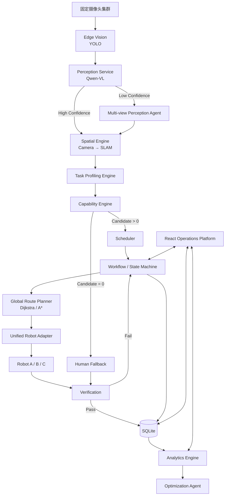

---

# 2. 软件工程架构

```mermaid
flowchart LR

    FRONT[React + TypeScript<br/>Vite + Tailwind + shadcn/ui]

    API[FastAPI REST API]
    SSE[SSE Event Stream]

    WF[Workflow Engine]
    PER[Perception]
    SPA[Spatial]
    SCH[Scheduling]
    ROB[Robot Adapter]
    VER[Verification]
    ANA[Analytics]
    AGT[LangGraph Agents]

    SQLITE[(SQLite)]

    FRONT --> API
    API --> WF

    WF --> PER
    WF --> SPA
    WF --> SCH
    WF --> ROB
    WF --> VER

    WF --> SQLITE

    ANA --> SQLITE
    AGT --> PER
    AGT --> ANA

    SSE --> FRONT
    WF --> SSE
```

---

# 3. Agent 与 Workflow 的关系

核心原则：

```text
确定性业务逻辑
→ Rule / Algorithm / Workflow

信息不确定
→ Agent
```

当前 Agent：

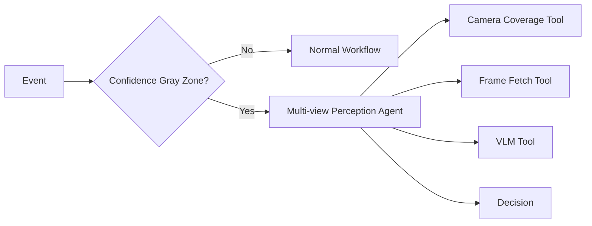

Optimization：

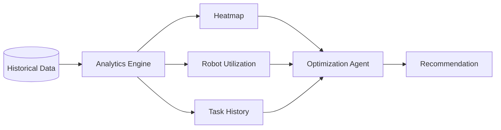

禁止把以下模块称为 Agent：

- Scheduler
- Route Planner
- Spatial Mapping
- Elevator
- Robot Adapter
- Verification
- Heatmap
- YOLO

---

# 4. AI 推理链路

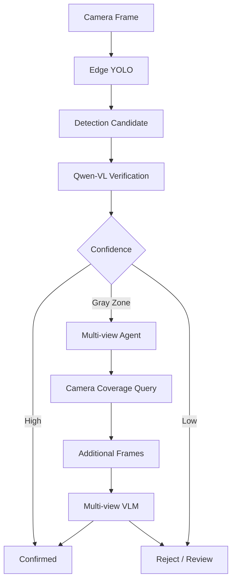

---

# 5. Camera → SLAM 坐标体系

空间层级：

```text
Park
 └─ Building
     └─ Floor
         └─ Zone
             └─ SLAM Coordinate(x,y)
```

Camera 输入：

```text
camera_id
pixel_u
pixel_v
bbox
```

通过四个固定标定点：

```mermaid
flowchart LR

    P[Camera Pixel<br/>(u,v)]

    CAL[4 Point Calibration]

    MAP[Coordinate Mapping]

    S[SLAM<br/>(x,y)]

    SEM[Building / Floor / Zone]

    P --> CAL
    CAL --> MAP
    MAP --> S
    S --> SEM
```

真实生产具体数学实现：

**待确认。**

V2 PoC：

实现稳定可重复二维映射。

---

# 6. 园区空间拓扑

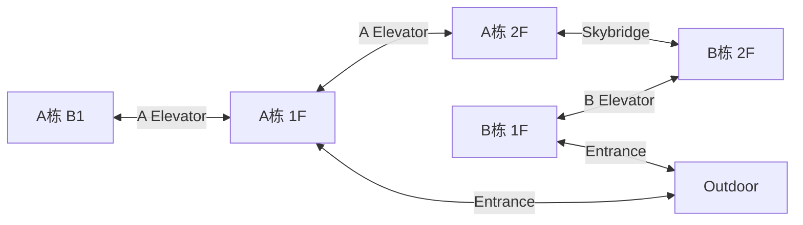

---

# 7. Robot Capability 关系

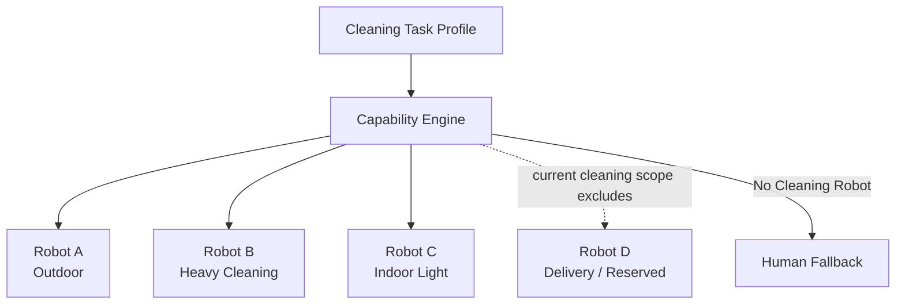

---

# 8. Robot A

服务：

```text
Outdoor
```

能力：

- 道路清扫
- 室外硬质地面
- 花岗岩
- 普通室外小垃圾

限制：

```text
elevator = false
skybridge = false
indoor = false
```

---

# 9. Robot B

服务：

```text
A_B1
A_1F
A_2F
其他允许的硬质室内区域
```

特点：

```text
wet_cleaning = strong
strong_suction = strong
scrubbing = strong
heavy_stain = strong
noise = high
size = large
elevator = true
```

---

# 10. Robot C

服务：

```text
A / B Indoor Public Area
```

特点：

```text
dry_debris = strong
wet_cleaning = weak
heavy_stain = unsupported
tile = true
carpet = true
noise = low
size = compact
elevator = true
skybridge = true
```

---

# 11. Robot D

配送机器人。

当前仅预留：

```text
robot_type = delivery
```

暂不加入：

- Cleaning Capability Engine
- Scheduler
- Scenario
- Workflow

---

# 12. Scheduler 架构

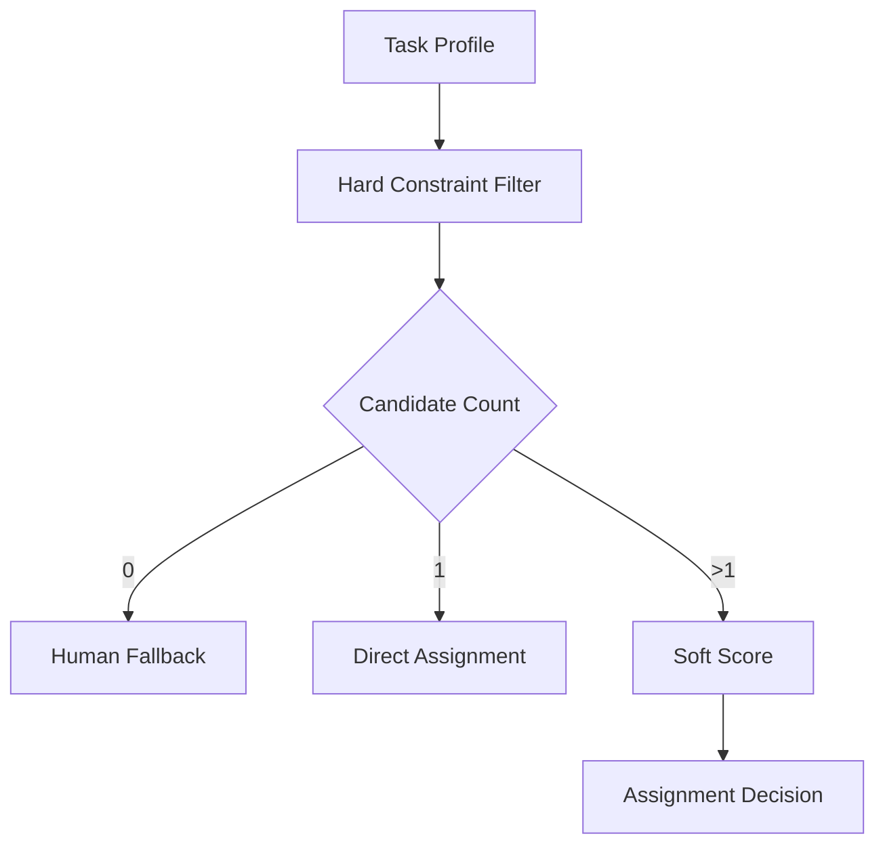

Soft Score：

```text
Task Capability Fit       25
ETA / Distance            25
Battery                   15
Current Workload          10
Zone Fitness              10
Floor / Elevator Cost      5
Cross-building Cost        5
Noise/Public-space Fit     5
```

必须配置化。

---

# 13. Global Route

例如 Robot C：

```text
B栋1F
→ B Elevator
→ B栋2F
→ Skybridge
→ A栋2F
→ A Elevator
→ A栋1F
→ Target
```

算法：

```text
Dijkstra 或 A*
```

不是：

- LLM
- Agent
- ROS Nav2

Local Route 和 Global Route 必须区分。

---

# 14. 事件状态机

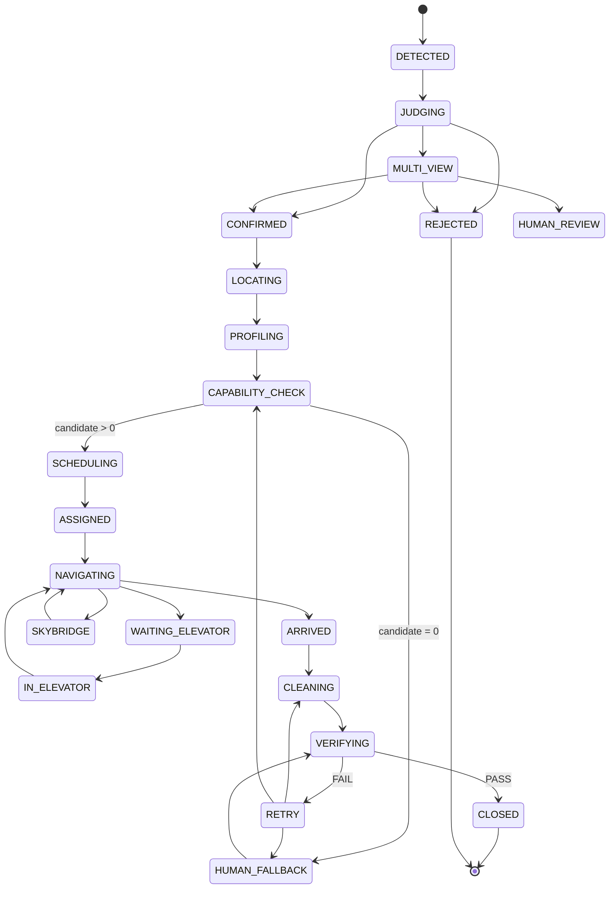

---

# 15. Robot-first + Human Fallback

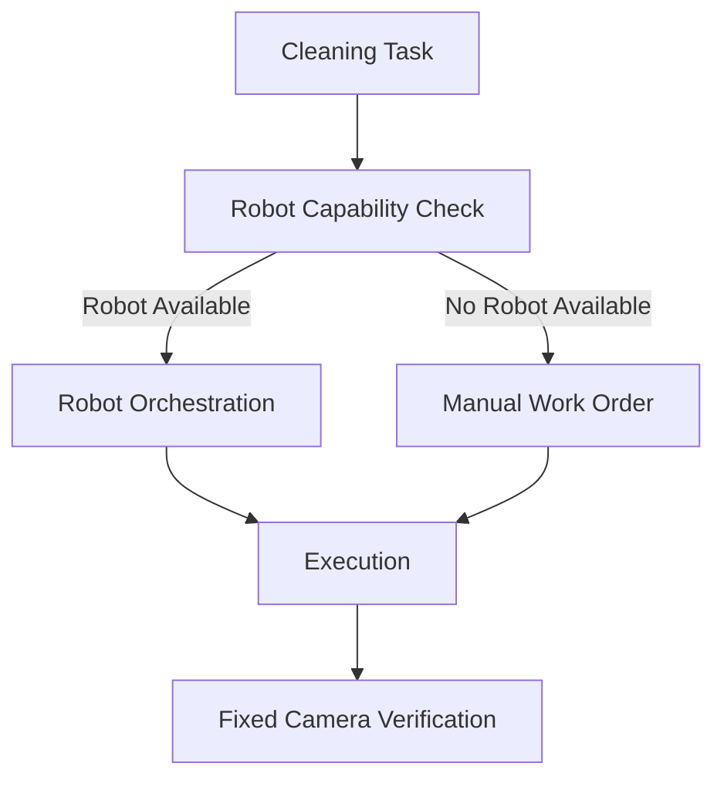

人工不是普通 Scheduler Resource。

---

# 16. Verification

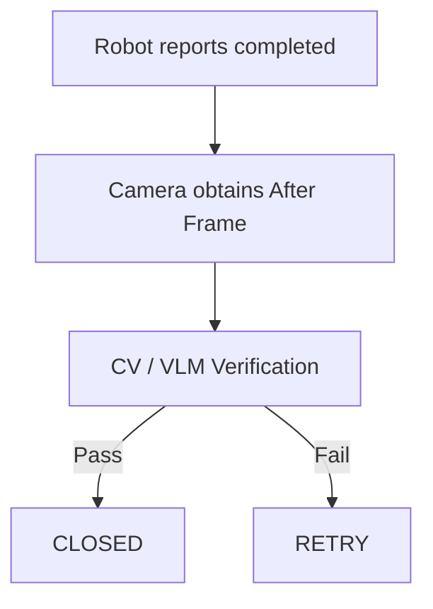

---

# 17. 数据对象

主要实体：

```text
Park
Building
Floor
Zone
Connector

Camera
CameraCalibration
CameraCoverage

CleaningEvent
TaskProfile

Robot
RobotCapability
RobotState

CleaningTask

AssignmentCandidate
AssignmentDecision

NavigationPlan

VerificationResult

HumanFallbackWorkOrder

HeatmapCell
OptimizationRecommendation
```

---

# 18. 前后端 API 规划

园区：

```text
GET /api/park/state
GET /api/spatial/maps
GET /api/spatial/graph
```

Camera：

```text
GET /api/cameras
GET /api/cameras/{id}
POST /api/spatial/map-camera-point
```

Event：

```text
POST /api/events
GET /api/events
GET /api/events/{event_id}
```

Perception：

```text
POST /api/perception/analyze
POST /api/perception/multiview
```

Scheduler：

```text
POST /api/scheduler/evaluate
POST /api/tasks/{task_id}/dispatch
```

Robot：

```text
GET /api/robots
GET /api/robots/{id}
POST /api/robots/{id}/task
POST /api/robots/{id}/cancel
```

Analytics：

```text
GET /api/analytics/heatmap
GET /api/analytics/kpis
POST /api/optimization/recommend
```

Scenario：

```text
GET /api/scenarios
POST /api/scenarios/{id}/start
POST /api/scenarios/reset
```

Real-time：

```text
GET /api/events/stream
```

当前已经实现的 Phase 1 API：

```text
GET /api/health
GET /api/dashboard
```

---

# 19. REAL / MOCK 降级

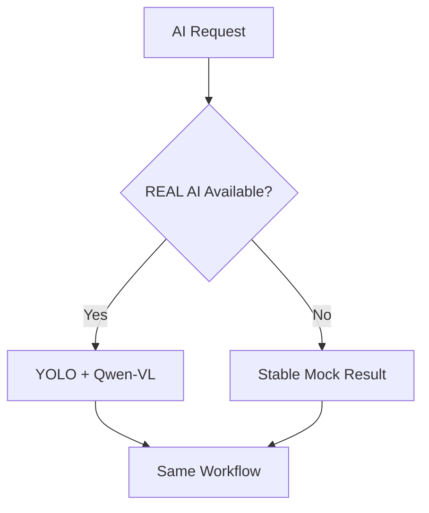

固定 Scenario 必须在无：

- API；
- 网络；
- 云模型；

情况下仍然可演示。

---

# 20. UI 架构

一级导航：

```text
01 Operations Dashboard
02 AI Event Center
03 Robot Orchestration
04 Optimization Center
05 AI Lab
```

主 Dashboard：

```text
Camera Feed
+
SLAM / Park Map
+
Decision Trace
+
KPI
```

地图为核心视觉区域。

UI 技术：

```text
React
TypeScript
Vite
TailwindCSS
shadcn/ui
Apache ECharts
Framer Motion
SVG
```

React Flow：

可选。

---

# 21. 开源参考架构

只做技术参考：

```text
ros-navigation/navigation2
open-rmf/rmf
open-rmf/rmf_demos
```

参考：

- Navigation Architecture
- Fleet
- Lift
- Door
- Task Allocation
- Map
- Multi-floor
- Simulation

当前不得未经授权增加 ROS / RMF Runtime。
````

---
