# AI 自主清洁 Demo｜技术架构

---

# 1. 系统总体架构

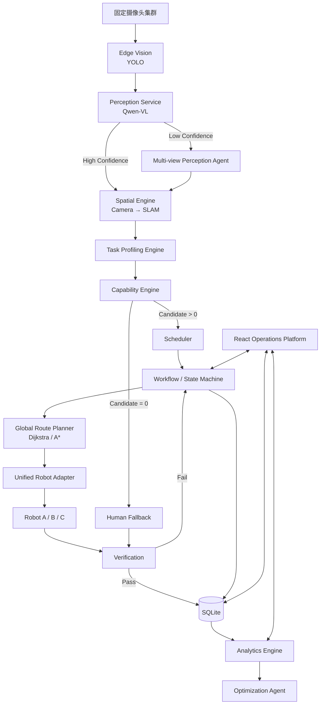

---

# 2. 软件工程架构

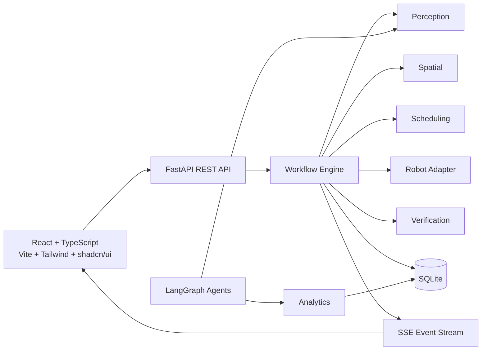

---

# 3. Agent 与 Workflow 的关系

核心原则：

```text
确定性业务逻辑
→ Rule / Algorithm / Workflow

信息不确定
→ Agent
```

当前 Agent：

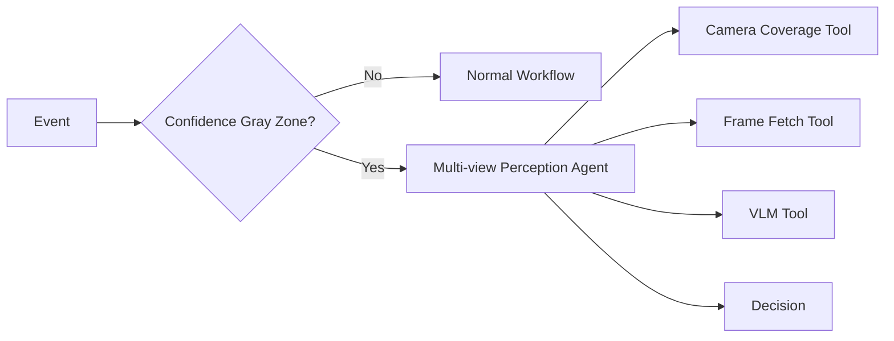

Optimization：

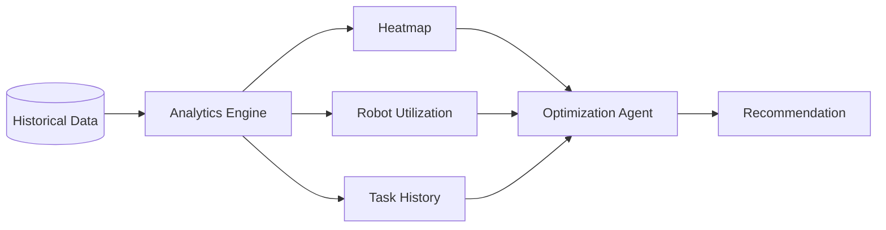

禁止把以下模块称为 Agent：

- Scheduler
- Route Planner
- Spatial Mapping
- Elevator
- Robot Adapter
- Verification
- Heatmap
- YOLO

---

# 4. AI 推理链路

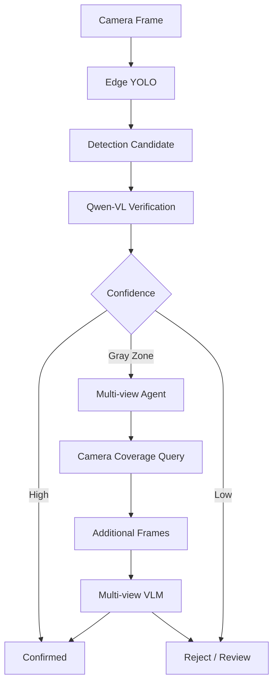

---

# 5. Camera → SLAM 坐标体系

空间层级：

```text
Park
 └─ Building
     └─ Floor
         └─ Zone
             └─ SLAM Coordinate(x,y)
```

Camera 输入：

```text
camera_id
pixel_u
pixel_v
bbox
```

通过四个固定标定点：

```mermaid
flowchart LR

    P[Camera Pixel<br/>(u,v)]

    CAL[4 Point Calibration]

    MAP[Coordinate Mapping]

    S[SLAM<br/>(x,y)]

    SEM[Building / Floor / Zone]

    P --> CAL
    CAL --> MAP
    MAP --> S
    S --> SEM
```

真实生产具体数学实现：

**待确认。**

PoC：

实现稳定可重复二维映射。

---

# 6. 园区空间拓扑

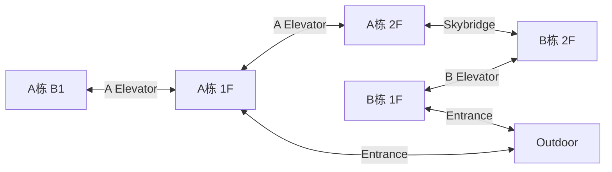

---

# 7. Robot Capability 关系

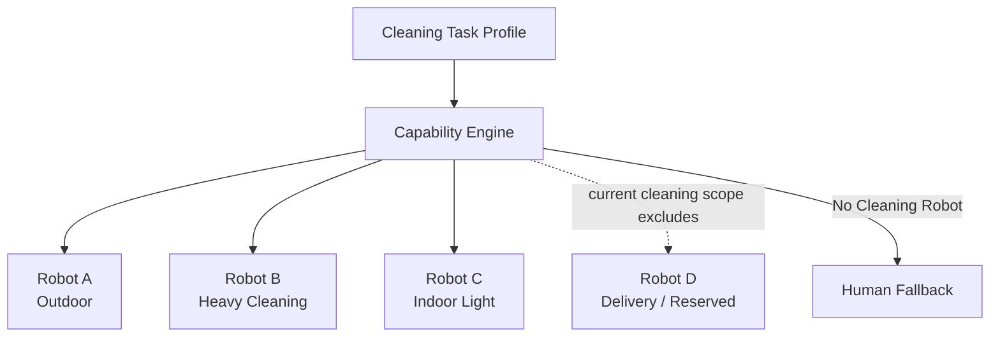

---

# 8. Robot A

服务：

```text
Outdoor
```

能力：

- 道路清扫
- 室外硬质地面
- 花岗岩
- 普通室外小垃圾

限制：

```text
elevator = false
skybridge = false
indoor = false
```

---

# 9. Robot B

服务：

```text
A_B1
A_1F
A_2F
其他允许的硬质室内区域
```

特点：

```text
wet_cleaning = strong
strong_suction = strong
scrubbing = strong
heavy_stain = strong
noise = high
size = large
elevator = true
```

---

# 10. Robot C

服务：

```text
A / B Indoor Public Area
```

特点：

```text
dry_debris = strong
wet_cleaning = weak
heavy_stain = unsupported
tile = true
carpet = true
noise = low
size = compact
elevator = true
skybridge = true
```

---

# 11. Robot D

配送机器人。

当前仅预留：

```text
robot_type = delivery
```

暂不加入：

- Cleaning Capability Engine
- Scheduler
- Scenario
- Workflow

---

# 12. Scheduler 架构

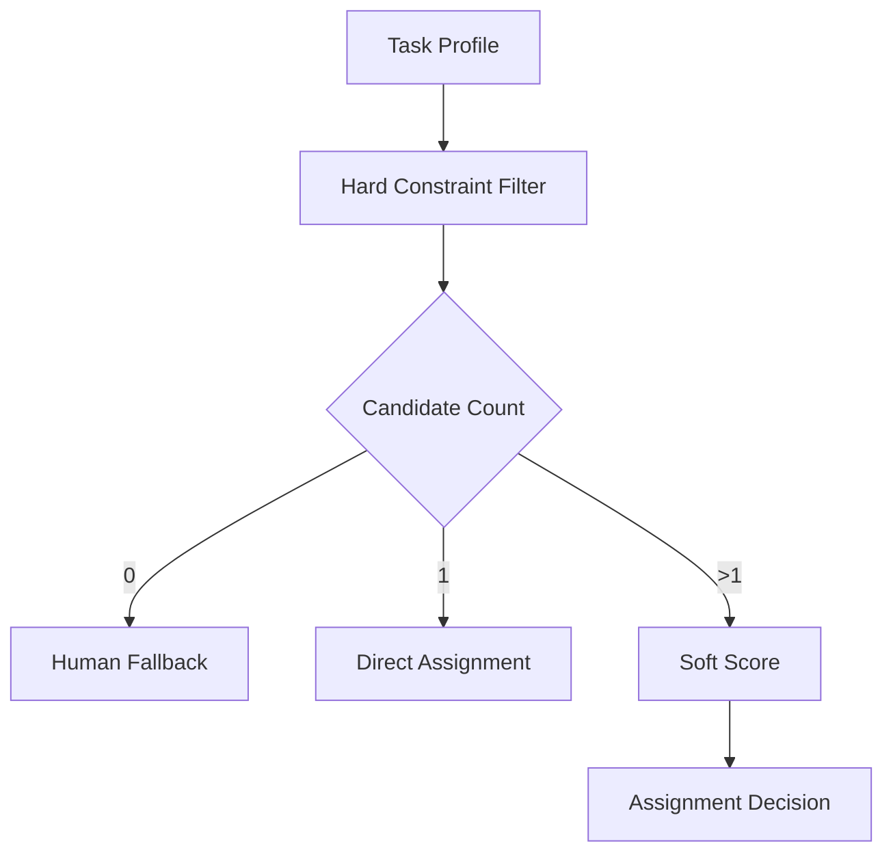

Soft Score：

```text
Task Capability Fit       25
ETA / Distance            25
Battery                   15
Current Workload          10
Zone Fitness              10
Floor / Elevator Cost      5
Cross-building Cost        5
Noise/Public-space Fit     5
```

必须配置化。

---

# 13. Global Route

例如 Robot C：

```text
B栋1F
→ B Elevator
→ B栋2F
→ Skybridge
→ A栋2F
→ A Elevator
→ A栋1F
→ Target
```

算法：

```text
Dijkstra 或 A*
```

不是：

- LLM
- Agent
- ROS Nav2

Local Route 和 Global Route 必须区分。

---

# 14. 事件状态机

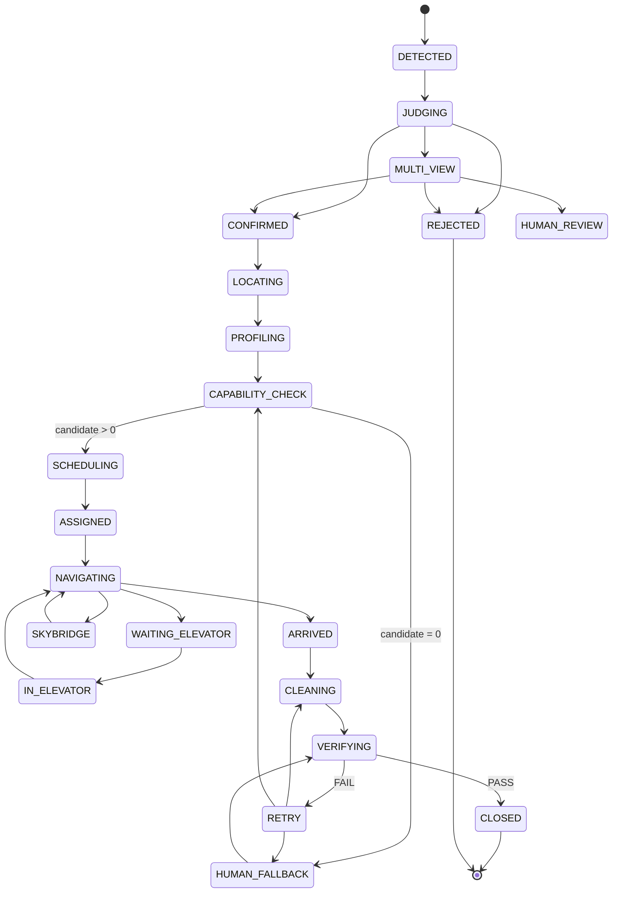

---

# 15. Robot-first + Human Fallback

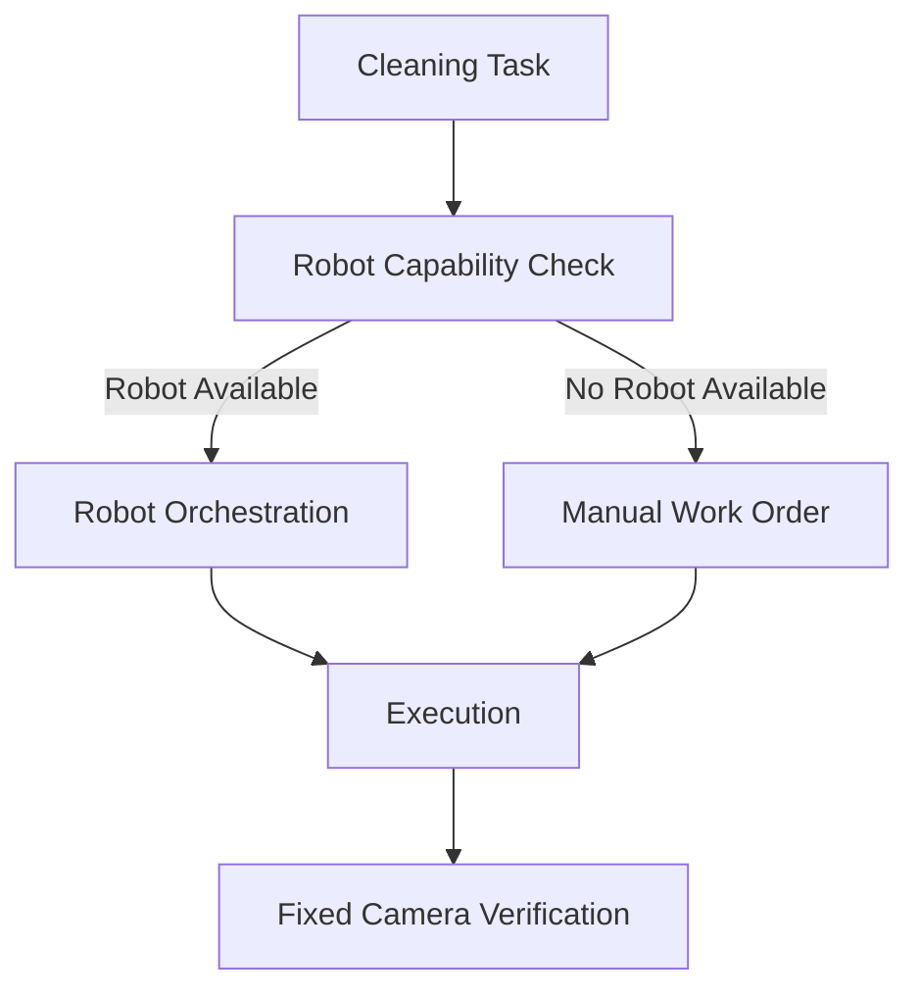

人工不是普通 Scheduler Resource。

---

# 16. Verification

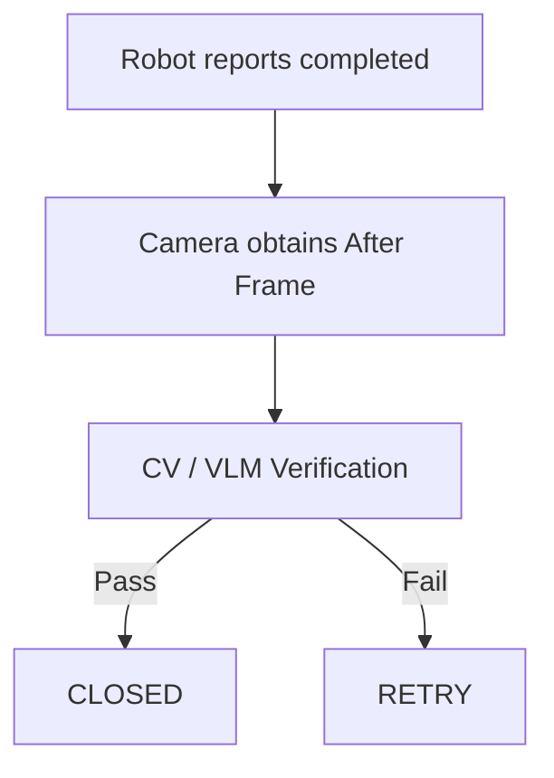

---

# 17. 数据对象

主要实体：

```text
Park
Building
Floor
Zone
Connector

Camera
CameraCalibration
CameraCoverage

CleaningEvent
TaskProfile

Robot
RobotCapability
RobotState

CleaningTask

AssignmentCandidate
AssignmentDecision

NavigationPlan

VerificationResult

HumanFallbackWorkOrder

HeatmapCell
OptimizationRecommendation
```

---

# 18. 前后端 API 规划

园区：

```text
GET /api/park/state
GET /api/spatial/maps
GET /api/spatial/graph
```

Camera：

```text
GET /api/cameras
GET /api/cameras/{id}
POST /api/spatial/map-camera-point
```

Event：

```text
POST /api/events
GET /api/events
GET /api/events/{event_id}
```

Perception：

```text
POST /api/perception/analyze
POST /api/perception/multiview
```

Scheduler：

```text
POST /api/scheduler/evaluate
POST /api/tasks/{task_id}/dispatch
```

Robot：

```text
GET /api/robots
GET /api/robots/{id}
POST /api/robots/{id}/task
POST /api/robots/{id}/cancel
```

Analytics：

```text
GET /api/analytics/overview
GET /api/analytics/heatmap
GET /api/analytics/kpis
GET /api/analytics/robot-utilization
GET /api/analytics/task-history
POST /api/optimization/recommend
```

Scenario：

```text
GET /api/scenarios
POST /api/scenarios/{id}/start
POST /api/scenarios/reset
```

Real-time：

```text
GET /api/events/stream
```

当前已经实现的 Phase 1 API：

```text
GET /api/health
GET /api/dashboard
```

当前已经实现的 Phase 2 / Phase 3 API：

```text
GET  /api/spatial/overview
GET  /api/spatial/routes
GET  /api/spatial/cameras/{camera_id}/map
GET  /api/events
GET  /api/events/{event_id}
GET  /api/events/templates
POST /api/events/mock/{template_name}
POST /api/events/{event_id}/run
POST /api/scheduler/evaluate?event_id=
GET  /api/events/stream
```

Phase 3 Runtime:

```text
Mock Event
→ Workflow State Machine
→ SQLite Transition Audit + SSE
→ Task Profile
→ Hard Constraints
→ Explainable Soft Score
→ Mock Adapter / Navigation Plan
→ Mock Verification
→ CLOSED or Human Fallback Work Order
```

---

# 19. REAL / MOCK 降级

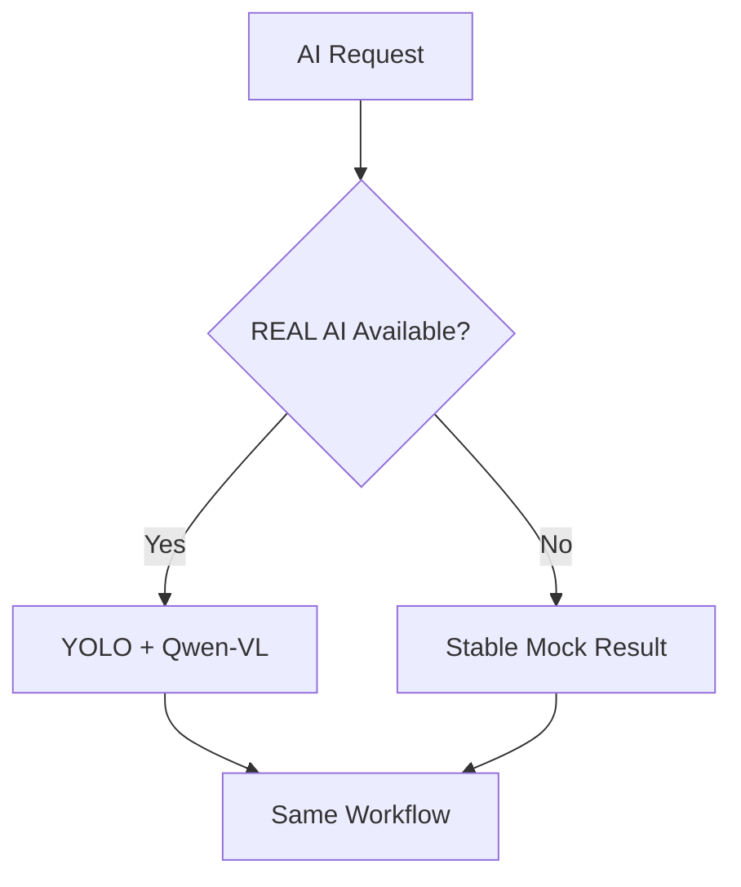

固定 Scenario 必须在无：

- API；
- 网络；
- 云模型；

情况下仍然可演示。

---

## 19.1 Phase 4 AI Lab Runtime

```text
AI Lab Upload (image / MP4)
→ runtime resolver
→ REAL: local YOLO → selected keyframe → DashScope Qwen-VL JSON
  or MOCK: stable local result
→ Detection Candidate + Camera → SLAM location + Task Profile
→ AI Lab response only
```

AI Lab 不创建 Cleaning Event，不执行 Scheduler，也不通过 Robot Adapter 控制设备。`AI_LAB_MODE=auto` 只在 `AI_LAB_YOLO_MODEL` 指向存在的本地权重且 `DASHSCOPE_API_KEY` 存在时启用 REAL；否则明确返回 `DEMO MOCK MODE`。MP4 的 REAL 流程取首、中、尾关键帧，并选择最高 YOLO confidence 的帧给 VLM。REAL 推理失败返回明确错误，不得伪造成功结果。

REAL 与 MOCK 都必须返回 `ai-lab.v1`：`perception.need_clean`、`perception.confidence`、完整 Phase 3 `TaskProfile`、Phase 2 `map_pixel_to_slam` 产生的带 `map_id` 的位置、`workflow_input` 与 `scheduler_preview`。后两项仅用于兼容性预检，绝不在 AI Lab 中写入 Cleaning Event 或启动调度。

## 19.2 Phase 5 Multi-view Perception Agent

```text
initial confidence
→ gray zone only: 0.55 <= confidence < 0.85
→ Camera Coverage Tool (Phase 2 CAMERAS / SLAM data)
→ Frame Fetch Tool (at most two additional cameras)
→ VLM Tool
→ CONFIRM | REJECT | HUMAN_REVIEW
→ existing Phase 3 workflow only after CONFIRM
```

该 LangGraph 图仅有三个可调用工具；iteration 上限为 2。审计 Trace 保留工具调用、证据、所选摄像头、最终置信度和最终决策，不保存或呈现 Chain-of-Thought。Scenario 02 的确认结果会回到既有 Capability Engine / Scheduler，未修改 Robot A/B/C 规则或 Robot-first + Human Fallback。

## 19.3 Phase 6 Analytics + Optimization

```text
30-day deterministic Mock history (300 events)
→ Analytics Engine: heatmap / time distribution / utilization / KPI
→ Heatmap Tool + Robot Utilization Tool + Task History Tool
→ Optimization recommendations
→ human review before any operations configuration change
```

Analytics Engine 是确定性聚合，不是 Agent。Optimization Agent 的输出仅为待机点、主动巡检、资源配置建议；它不修改 YOLO / VLM confidence、Capability Engine、Scheduler 或 Robot-first + Human Fallback。前端仅在 Optimization Center 使用按需注册的 Apache ECharts 组件展示图表。

## 19.4 Phase 7 Interview UX

```text
AI Event Center → 4 stable scenarios → deterministic workflow audit
→ Decision Trace / Why Robot X? / Camera → SLAM / Before-After
→ Mock mission playback: Robot / Elevator / Skybridge
```

Phase 7 只消费既有 API 和审计数据；播放效果是前端对已完成 Mock 状态序列的可视化，绝不代表实时设备控制或遥测。五个一级页面将 Operations、Event、Orchestration、Optimization、AI Lab 组织为可在面试中顺序讲解的路径。

## 19.5 Phase 8 Customer Demo Workbench

```text
Camera asset / upload
→ Phase 4 ai-lab.v1 low-confidence perception
→ Phase 5 Multi-view confirmation
→ Phase 2 map_pixel_to_slam
→ Phase 3 Capability + Scheduler + Robot Adapter + Verification
→ customer-facing business timeline and Before / After
```

`workbench.service` 只组合上述已有结果。`/api/workbench/scenarios` 返回四个 `Camera + Event + View` 素材关系，`/api/workbench/events/{event_id}/run` 返回既有感知、工作流和多视角审计，`/api/workbench/upload` 仅以 SHA-256 匹配四张受控清洁前原图后运行同一链路。`/demo-assets` 只静态提供实际存在的授权文件；没有素材时，前端显示缺失槽位，绝不返回伪造图片。大型纸箱是 Human Fallback，不具备清洁后图时只能展示人工工单与待回传验收。

## 19.6 Operations Command Center Projection

```text
existing Workflow audit + Spatial robot positions + approved asset manifest
→ operations.service (read-only DEMO_PLAYBACK projection)
→ /api/operations/snapshot
→ fleet command bar + work-order queue + SLAM mission map + audit UI
```

`operations.service` 是客户指挥台的组合读模型，不是新的 Workflow、Scheduler、Route Planner 或 Agent。它只能消费既有 `workbench.service` 的完整审计结果和 Phase 2 `ROBOT_POSITIONS`，并按已记录的状态检查点投影 Robot A/B/C 的**模拟**位置、状态、电量和活动描述。它不写入或改写既有调度决策；前端不再以 `setTimeout` 自行推进业务状态。`operations.v1` 的每个响应带有 `telemetry_mode: DEMO_PLAYBACK`，因此不应被描述为实时机器人遥测。

## 19.7 Phase 8R Product + REAL AI Boundary

```text
Camera demo asset / real camera frame
→ local YOLO (raw class + box + confidence, REAL or MOCK)
→ DashScope Qwen-VL (business class + Task Profile, REAL or MOCK)
→ Multi-view Perception Agent only in confidence gray zone
→ BusinessDetection (business class separated from raw labels)
→ existing map_pixel_to_slam
→ existing Capability Engine + Scheduler
→ persisted CleaningEvent
→ Mock Robot Simulation
→ post-clean camera → AI verification → VERIFYING → CLOSED
```

`BusinessDetection` is a presentation / audit record, not a detector. Its `business_class` must be one of `liquid / can / leaf / large_object / small_litter`; it retains `raw_yolo_class`, `raw_yolo_confidence`, `vlm_class`, `vlm_confidence` and `confidence_source`. No layer is permitted to synthesize a YOLO box or confidence for a class unsupported by the actual model. `GET /api/system/ai-status` reads local configuration only and does not make an unprompted cloud request. The root `.env` is never committed; REAL mode requires both the configured local weight file and `DASHSCOPE_API_KEY`.

For exact SHA-256 matches of the approved customer-demo before images only, `workbench.preset_detections` adds `detection_overlays` to the existing asset manifest. Each overlay carries normalised image coordinates, a display confidence and `source: CONTROLLED_REPLAY`; the frontend's `DetectionFrame` renders it over the unmodified source frame. The response preserves this provenance through `business_detections.confidence_source`; it never upgrades the record to a raw YOLO result. The same `DemoAsset` is consumed by the event scene, work-order detail and before/after comparison, so one frame cannot show a different box from another part of the product.

---

# 20. UI 架构

一级导航：

```text
01 Operations Dashboard
02 AI Event Center
03 Robot Orchestration
04 Optimization Center
05 AI Lab
```

主 Dashboard：

```text
Camera Feed
+
SLAM / Park Map
+
Decision Trace
+
KPI
```

地图为核心视觉区域。

UI 技术：

```text
React
TypeScript
Vite
TailwindCSS
shadcn/ui
Apache ECharts
Framer Motion
SVG
```

React Flow：

可选。

---

# 21. 开源参考架构

只做技术参考：

```text
ros-navigation/navigation2
open-rmf/rmf
open-rmf/rmf_demos
```

参考：

- Navigation Architecture
- Fleet
- Lift
- Door
- Task Allocation
- Map
- Multi-floor
- Simulation

当前不得未经授权增加 ROS / RMF Runtime。
````

---

## 21. Independent Custom YOLO Training Utility

```text
user-authorized ZIP photos (local only)
→ audit / fixed five-class annotation manifest
→ YOLO images/train + images/val + after-image holdout
→ Chinese bounding-box review previews
→ YOLO11n training (MPS first, CPU fallback)
→ local best.pt + per-image inference report
→ user review
→ (only after explicit approval) Phase 8R REAL YOLO adapter configuration
```

`tools/custom_yolo_demo.py` is an offline development utility, not an API or a second runtime perception service. It never creates a CleaningEvent, calls Camera → SLAM, changes Scheduler / Capability rules, calls an Agent, or alters the customer UI. The provenance and fixed class order are committed in `datasets/ai_cleaning_yolo/annotations.json`; user images, review previews and weights are Git-ignored. The integration arrow is deliberately inactive until user approval.
