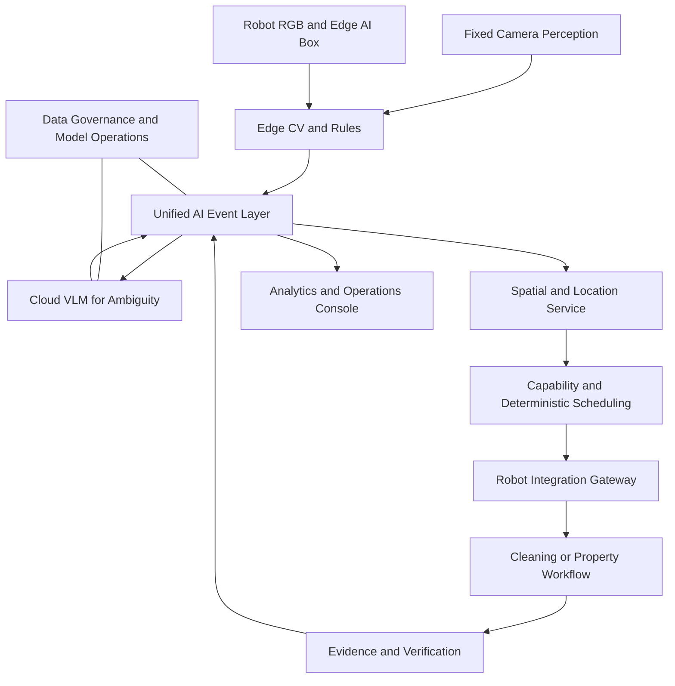
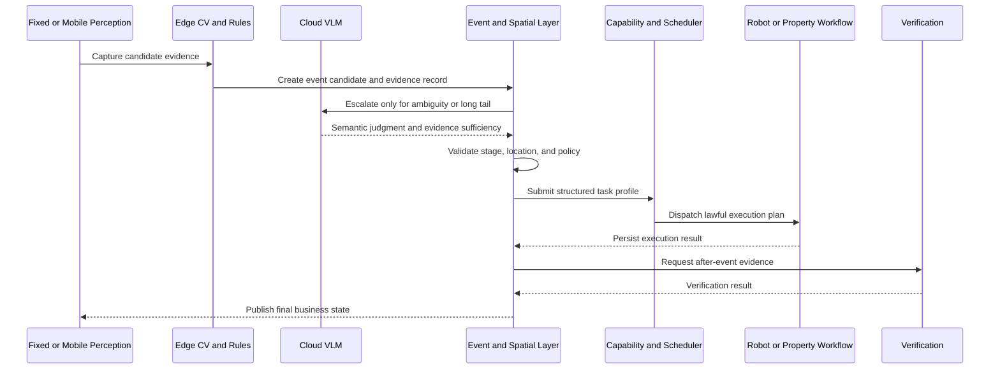

# AI 自主清洁与移动巡检一体化系统

> 面试架构设计唯一母文档（Markdown Source of Truth）

## 文档定位

[CONFIRMED] 本文档维护《AI 自主清洁与移动巡检一体化系统》在面试架构设计中的最新有效结论。它服务于 AI 解决方案工程师 / AI 解决方案专家面试展示，证明业务理解、AI 架构能力、机器人系统整合、产品设计、成本意识、工程可落地性与规模化能力。

本文档只管理面试架构设计，不替代 Demo 的实现、验收或运行文档。每次更新必须先完整阅读本文档；新结论应融合到对应章节，失效方案应删除，重复内容应合并。若新结论与本文档的 [LOCKED] 决策冲突，必须先提示并等待确认，不得自行覆盖。

## 1. 行业背景、客户需求与解决方案目标 [LOCKED]

本章先回答项目为何产生、客户的真实问题、传统机器人能力边界、万物云的业务基础、产品为何升级为自主清洁与移动巡检一体化系统，以及该系统最终服务的业务目标。YOLO、VLM、SLAM 等技术细节不作为本章重点。

### 1.1 行业与公司资源基础

项目不是为面试凭空设计的 Demo，而是源自大型物业客户在实际沟通中提出的业务需求。用户所在公司万物云长期服务大型物业，并通过科技能力增强物业服务、项目签约与项目竞争能力；服务场景覆盖大型产业园区、企业园区、商业空间、办公楼宇及其他大型物业项目。

万物云的优势不在于制造清洁机器人，而在于长期处于物业运营一线，同时接触客户、物业管理流程、保洁团队、安保团队、固定摄像头、园区基础设施、机器人厂商与不同机器人的实际应用情况。因此，物业科技企业更容易发现机器人本体能力与物业真实运营需求之间的断层。

万物云与多个机器人厂商存在合作关系。若形成一套可跨品牌机器人复用的 AI 自主清洁与巡检系统，便具备将客户场景、AI 能力、物业业务流程与机器人生态整合为行业解决方案的条件。

> [PUBLIC FACT CHECK REQUIRED] “行业第一”、具体客户案例或排名等对外宣传式表述，必须经万物云官网、公开新闻稿或其他公开资料验证后才能写成正式事实；本母文档不将未经核验的表述作为绝对事实。

### 1.2 客户需求与传统清洁机器人的能力断层

客户多次提出，现有清洁机器人已具备 SLAM、导航、避障、自动清洁与路线执行等成熟能力，但主要仍按固定时间、固定区域、固定路线和预设规则工作，即 Schedule-driven Cleaning。

例如，机器人每天上午 10 点清扫大厅；若 10:15 有人将饮料洒在地面，传统规则式机器人不会因为环境刚出现新的清洁需求而主动调整任务优先级。问题不是机器人不会清洁，而是机器人不知道现在什么地方最需要清洁。

传统机器人主要解决 “How to clean?”；本系统进一步解决 “When and where should cleaning happen?”：何时需要清洁、哪里需要清洁、应派哪种机器人，以及清洁是否真正完成。客户真正需要的是 Event-driven Cleaning。

### 1.3 产品创新一：从规则式清洁升级为事件驱动自主清洁

项目第一层产品创新是利用园区既有固定摄像头形成环境感知网络，并建立以下闭环：

Fixed Camera → AI Event Detection → 垃圾、污渍或清洁需求研判 → 必要时 AI Semantic Judgment → Camera-to-SLAM Coordinate Mapping → 结构化 Cleaning Task Profile → Robot Capability Matching → Deterministic Scheduling → Robot Execution → Fixed Camera After-clean Evidence → AI Verification → Closed Loop。

机器人不再只是按照既定计划执行的独立设备，而是由环境事件动态驱动的执行终端。面试核心表达为：**传统机器人重点解决“怎么扫”，本系统进一步解决“什么时候、去哪里扫”。**

### 1.4 产品创新二：机器人升级为移动视觉感知节点

在与客户及机器人厂商的进一步沟通中，机器人不再只被视为 Cleaning Robot。机器人已有 RGB Camera，且每天都会沿机器人厂商原生规则清洁路线、AI 动态清洁任务路线、正常导航路径和跨区域任务路径真实移动。

系统复用这些既有移动行为与 RGB Camera，使机器人在完成原本任务时进行 **Opportunistic Mobile Inspection（伴随式移动视觉巡检）**。这不是为了巡检再专门跑一遍路线，而是在本来就会发生的机器人移动过程中顺路完成视觉巡检，提高单位机器人资产利用率。

机器人因此具有双重身份：

- Cleaning Actuator：清洁执行终端。
- Mobile Perception Node：移动视觉感知节点。

### 1.5 Robot Edge AI Box

为实现统一接入与移动 AI 感知，机器人侧增加 **Robot Edge AI Box（机器人边缘 AI 终端）**。它不是机器人导航主控，不替代机器人厂商既有的 SLAM、底盘控制、避障、运动控制或清洁控制。

其职责分为两部分：

1. **Robot Interface Integration**：通过机器人厂商开放接口接入机器人状态、位置、电量、当前任务、任务下发、执行状态、执行结果及必要设备能力，形成跨品牌机器人的统一上层接入。
2. **Mobile Vision AI**：接入机器人自身 RGB Camera，在边缘终端部署 YOLO、专项 CV 模型与规则逻辑等适合本地运行的视觉能力，使机器人在移动途中识别物业巡检事件。

第一阶段典型场景为非机动车违停、垃圾桶周边散落垃圾、公共区域散落垃圾，以及其他适合用专项 CV 稳定识别的物业巡检事件。Robot Edge AI Box 因而同时连接机器人 Action / Status Interface 与 RGB Perception，是 **Robot Integration Gateway + Mobile Edge AI Node**。

### 1.6 Fixed + Mobile Dual Perception

系统不是单一固定摄像头架构，而是由 **Fixed Camera Perception + Robot Mobile Perception** 组成互补的双感知能力。

Fixed Camera 提供 7×24 持续覆盖、固定稳定视角、持续事件发现、清洁前后对比和最终 AI 验收；其边界是固定摄像头盲区、支路或转角等区域覆盖不足，扩大覆盖通常需要新增摄像头与施工成本。

Robot RGB Camera 随机器人持续移动，可覆盖固定摄像头无法持续观察的区域，复用既有路线顺路巡检，无需为简单巡检另增一套移动设备，并提升既有机器人资产的感知价值。

两者汇入统一事件层：

Fixed Camera Perception → Unified AI Event Layer ← Robot Mobile Perception。

正式架构概念为 **Fixed + Mobile Dual Perception**。

### 1.7 清洁事件与巡检事件必须分流

移动机器人发现事件，不等于机器人必须自己处理该事件；机器人既可以是执行器，也可以只是感知节点。**Perception ≠ Execution** 是本项目的重要产品与技术边界。

例如，机器人 RGB 通过 Edge CV 发现垃圾桶周边散落垃圾后，事件作为 Cleaning Event 进入 Capability Engine：若当前机器人具备清洁能力则执行清洁；否则由其他机器人或 Human Work Order 处理。

若发现非机动车违停，则作为 Patrol Event 进入 Property / Security Workflow，由安保或物业人员处置；机器人不负责移动非机动车。Patrol Event 是业务事件分流，不表示新增 Patrol Agent。

### 1.8 产品正式升级定位

原项目为“AI 自主清洁闭环系统”，现正式升级为：**AI 自主清洁与移动巡检一体化系统**。

推荐完整定位如下：面向大型园区物业场景，通过固定摄像头与机器人移动 RGB 视觉组成双感知网络，利用边云协同 AI 完成现场事件发现与研判，通过空间定位、机器人能力模型和确定性调度完成自主处置，并利用机器人既有移动路径进行伴随式巡检，最终形成发现 → 研判 → 定位 → 调度 → 执行 → 验收 → 运营的一体化物业 AI 闭环。

机器人正式定义保持为：**Cleaning Actuator + Mobile Perception Node**。

### 1.9 三方价值模型

本方案形成甲方客户、机器人厂商与万物云的三方价值闭环。

**甲方客户**从 Cleaning Automation 升级为 Cleaning Automation + Patrol Automation，其价值机制包括减少重复人工保洁巡查、降低部分安保人工巡检工作量、提升异常事件发现速度、提高机器人设备利用率，以及从固定计划运营转向事件驱动运营。未经真实项目数据验证，不直接宣称减少具体人数或伪造百分比 ROI。

**机器人厂商**继续提供 Robot Hardware、SLAM、Navigation、Obstacle Avoidance、Cleaning Capability 与 Device Control；本系统提供物业业务场景、AI Event Intelligence、Multi-robot Integration 与 Upper-level Orchestration。双方是 **Robot OEM Capability + Property AI Orchestration** 的协作关系，而非替代关系。潜在价值是扩大机器人项目落地、打开物业应用场景、形成头部客户标杆、增强品牌影响与增加硬件销售机会。

**万物云**不需要成为机器人制造商，其核心价值来自客户场景、物业运营能力、AI 视觉能力、现场数据与多机器人生态整合。最终销售的不是单一 Robot Hardware，而是 AI 自主清洁与移动巡检行业解决方案，形成科技物业产品能力。

### 1.10 六项总体架构目标

1. **Event-driven**：从 Schedule-driven Cleaning 升级为 Event-driven Cleaning / Inspection。
2. **Fixed + Mobile**：形成 Fixed Camera + Robot RGB Camera 的双感知网络。
3. **Robot Agnostic**：通过 Robot Adapter + Capability Profile 降低对单一机器人厂商的绑定；不同项目可采用不同数量、品牌和能力的机器人，但共享统一上层架构。
4. **AI + Deterministic**：AI 主要解决 Perception Uncertainty；Spatial、Capability、Scheduling、Route 与 Execution 由确定性算法负责，避免 LLM 控制所有环节。
5. **Cost-aware**：随着数据成熟，将已验证的高频稳定问题从 Cloud 迁移至 Edge，提高 Edge Coverage，降低 Cloud Escalation Rate 与长期 AI TCO。
6. **Scalable**：通过 Tenant Data Isolation + Authorized Capability Reuse 形成 Global Base Capability + Site-specific Adaptation，缩短新项目 Cold Start 与交付适配周期。

### 1.11 第一章最终因果链

大型物业真实场景 → 客户提出创新机器人需求 → 传统机器人仅能 Schedule-driven Cleaning → 缺乏环境事件主动发现能力 → Fixed Camera 促成 Event-driven Cleaning → 机器人从规则设备升级为动态执行终端 → 进一步利用 Robot RGB → Robot Edge AI Box → 机器人升级为 Mobile Perception Node → Fixed + Mobile Dual Perception → Cleaning + Patrol → 甲方 / Robot OEM / 万物云三方价值 → Cost-aware + Scalable AI Architecture。

## 2. 系统整体架构总览 [CONFIRMED]

本系统以“环境事件驱动、确定性处置、边云协同感知”为核心。面向客户的不是机器人控制台，而是统一的物业事件运营平台：固定摄像头与机器人移动视觉发现事件，AI 负责研判不确定性，确定性系统负责定位、能力匹配、调度、执行与验收。

目标架构包含六层：

1. **感知层**：Fixed Camera、Robot RGB 与 Robot Edge AI Box 产生可追溯的现场证据。
2. **AI 研判层**：Edge CV、规则与 Cloud VLM 识别事件、补充语义并判断证据是否充分。
3. **事件与空间层**：Unified AI Event Layer 统一事件事实；空间服务把合法视觉定位转换为可执行的空间目标。
4. **编排与执行层**：Capability Engine、Deterministic Scheduler、Route Planning 与 Robot Integration Gateway 负责受限的确定性处置。
5. **运营层**：事件中心、运营分析与 Robot Operations Agent 只消费同一业务事实，不维护第二份状态。
6. **治理层**：租户隔离、数据授权、模型评估、审计、回滚和成本治理贯穿全流程。

边界明确：机器人厂商仍负责底盘、SLAM、导航、避障与设备控制；本系统负责跨设备的上层事件智能、业务编排和物业运营闭环。

## 3. 自主清洁与移动巡检业务闭环 [CONFIRMED]

### 3.1 自主清洁闭环

清洁闭环从可验证的环境事件开始：发现垃圾、污渍或清洁需求后，系统先判定证据是否足以进入处置；必要时补充合法视角，再完成位置转换、Task Profile 生成、能力匹配和确定性调度。机器人执行后，固定摄像头或合法现场证据进入验收，最终将事件关闭或转入安全的人工处理路径。

核心原则是“先证据、后调度”：没有充分证据、合法位置或合格机器人时，系统不伪造自动处置。

### 3.2 伴随式移动巡检闭环

机器人在原生清洁、动态清洁或正常导航中持续产生移动视觉输入。Robot Edge AI Box 在边缘侧筛选适合 CV 稳定识别的场景，并将候选事件送入 Unified AI Event Layer。事件按类型分流：清洁事件进入清洁工作流；违停等 Patrol Event 进入物业或安保工作流。

伴随式巡检不应为简单巡检额外规划路线。它复用既有移动行为，补足固定摄像头盲区，并在不替代人或机器人既有职责的前提下提高资产利用率。

### 3.3 异常与人工闭环

当证据不足、空间定位失败、无合格机器人、路线不可达或验收无法确认时，系统进入可解释的 Human Review 或 Human Fallback。人工处置完成后，事件回到验证环节；人工不是被静默忽略的异常出口，而是闭环中可审计、可复核的正式参与者。

## 4. Event 技术数据流 / 时序 [CONFIRMED]

Unified AI Event Layer 是所有业务投影的唯一事件事实源。它记录事件来源、证据、语义判断、位置、处置建议、执行轨迹与最终结果；页面、分析和 Agent 只能读取或在受控权限下委托该事实链。

事件至少遵守以下数据原则：

- **证据先于结论**：未来阶段的 After Evidence、未实际取得的补充视角和未授权数据不得被当前业务消费者读取。
- **模型判断与系统决策分离**：模型输出语义、置信度和证据充分性；业务规则决定是否定位、派单、转人工或关闭。
- **阶段不可倒退**：状态迁移必须合法、可审计，并在失败后留下可解释终态。
- **同一事实多处投影**：运营页面、事件详情、Agent、分析和高级审计读取相同事件链，而不是复制业务状态。

Patrol Event 与 CleaningEvent 是否采用统一 Event Schema 仍保留为开放决策；无论最终模型如何，事件层都必须支持按事件类型分流，并保留统一的审计与证据原则。

## 5. Edge / Cloud AI 感知架构 [CONFIRMED]

边云协同的目的不是把所有视觉任务交给云端，也不是让边缘端承担长尾语义。系统根据任务频率、稳定性、时效性和不确定性在 Edge 与 Cloud 之间分工。

| 层级 | 主要职责 | 典型输入 | 输出边界 |
| --- | --- | --- | --- |
| Edge | 高频候选发现、专项 CV、规则过滤、设备侧事件预处理 | Fixed Camera / Robot RGB | 候选、结构化视觉事实、质量信号 |
| Cloud | 冷启动、长尾问题、低置信度、OOD、语义歧义与复杂上下文研判 | 合法且当前可用的证据集 | 语义判断、证据充分性、风险提示 |
| Deterministic System | 空间、能力、调度、路线、状态机与权限约束 | 已验证的业务事实 | 可执行或安全终止的系统决策 |

Cloud VLM 是受限的 Intelligence Layer，而非机器人调度器。它不能直接选择机器人、修改地图、调整阈值、绕过能力约束或替代流程状态机。默认架构不引入 Local Small VLM；只有在业务、硬件、离线评估和运维边界都明确后，才可另行评估。

Cloud VLM 的输出可作为 Teacher Signal、人工复核线索或迁移候选依据，但不等于 Ground Truth。训练、标注与生产处置必须经过独立验证和治理，禁止自动无监督在线自学习叙事。

## 6. Cloud-to-Edge Capability Flywheel [CONFIRMED]

能力飞轮的目标是把已经在生产语境中验证清楚的高频问题，从昂贵、通用的 Cloud Intelligence 迁移为便宜、稳定、确定性的 Edge Intelligence；它不是让 YOLO 变成大模型，也不是把所有问题都迁移到边缘。

```mermaid
flowchart LR
    hardcase[Cloud Hard Case] --> verified[Verified and Governed Data]
    verified --> score[Edge Migration Score]
    score --> candidate[Specialized CV or CV plus Rules]
    candidate --> evaluation[Offline and Hard-case Evaluation]
    evaluation --> shadow[Shadow Mode]
    shadow --> canary[Canary Release]
    canary --> production[Edge Production]
    production --> monitor[Monitoring and Rollback]
    monitor --> coverage[Higher Edge Coverage]
    coverage --> lower[Lower Cloud Escalation]
```

每个候选能力使用五项 Edge Migration Score 评估：Event Frequency、Visual Stability、Task Definability、Data Maturity 和 Economic Benefit，每项 0–5 分。

- 20–25 分：Priority Migration。
- 15–19 分：Candidate Pool，继续积累数据和验证。
- 低于 15 分：Keep Cloud。

迁移结果可以是复用现有 CV + Rule、新建专项 CV，或继续保留 Cloud。模型推广必须经过 Training → Offline Evaluation → Hard Case Regression → Shadow Mode → Canary → Production → Monitoring → Rollback。任何一个阶段不通过，都回到数据、规则或 Cloud 路径，而不是自动扩大上线范围。

## 7. Portfolio Flywheel [CONFIRMED]

组合能力飞轮在保证客户数据主权的前提下，缩短新项目的冷启动和适配周期。原则是 **Tenant Data Isolation + Authorized Capability Reuse**。

每个客户的 Raw Data、事件、图像、任务和运营数据默认隔离，不能因同属一个物业科技平台而直接互通。只有经过客户授权、脱敏、治理审查和标签统一的数据，才可进入 Authorized Common Dataset。

在授权边界内，平台可沉淀可复用的基础能力：

1. 从多项目的授权样本中形成 Global Base Capability。
2. 以园区地图、机器人能力、业务规则和现场视觉差异完成 Site-specific Adaptation。
3. 将成熟的行业能力以受控方式带入新项目，减少 Cold Start 与交付适配成本。

可复用的是经过治理的能力、方法和模型资产，不是客户原始数据或未经授权的业务事实。

## 8. 机器人确定性调度架构 [CONFIRMED]

机器人调度必须是确定性系统。AI 可以识别“发生了什么”，但不负责决定“哪台机器人执行”；机器人选择由可审计的业务约束和算法完成。

```mermaid
flowchart LR
    profile[Task Profile] --> capability[Capability Engine]
    capability --> filter[Hard Constraint Filter]
    filter --> eligible[Eligible Robots]
    eligible --> scoring[Deterministic Scoring]
    scoring --> route[Route Planning]
    route --> assignment[Robot Assignment]
    assignment --> execution[Execution or Safe Fallback]
```

### 8.1 Task Profile

Task Profile 由事件事实生成，描述任务类别、位置、所需能力、紧急程度、时间要求、证据与处理约束。它是感知层到调度层的契约，不携带模型的自由文本推理作为执行指令。

### 8.2 能力与约束

Capability Engine 根据机器人能力画像判断任务适配性；Hard Constraint Filter 排除不具备任务能力、位置或部署权限不符、正在执行冲突任务、电量或安全条件不满足、路线不可达的机器人。没有合格机器人时，系统转入 Human Fallback 或等待人工编排，而非让模型猜测替代方案。

### 8.3 评分、路线与执行

Eligible Robots 按明确的确定性评分规则排序，例如任务适配度、可达性、状态、电量、距离与业务优先级；Route Planning 在统一空间图中验证可行路径后，才生成 Assignment。评分权重和业务规则可配置、可版本化、可审计，但不能由 LLM 在运行时自行改写。

## 9. Agent 设计与边界 [CONFIRMED]

系统只保留两个 Agent，且二者的自主性均被限定在明确的工具与业务边界内。

| Agent | 解决的问题 | 允许的自主性 | 明确禁止 |
| --- | --- | --- | --- |
| Multi-view Perception Agent | 单一视角证据不足时，如何取得合法补充证据 | 在 Coverage 与证据白名单内发现、获取并判断补充视角 | 修改地图、标定、阈值、机器人能力、调度或路线 |
| Robot Operations Agent | 如何理解自然语言运营查询、任务意图和受限低风险操作 | 调用白名单读工具、生成分析、编排合法低风险工具动作 | 选择清洁机器人、直接控制底盘、绕过 Policy Guard、修改基础设施 |

Multi-view Perception Agent 只在可恢复的证据不足场景工作，补证数量、轮次和证据范围受预算限制；充分证据后由系统进入统一业务流程。

Robot Operations Agent 面向运营人员，是自然语言入口而非独立控制平面。它读取同一事件、任务、机器人和分析事实；如需执行动作，必须经过工具参数校验、权限、部署策略和 Policy Guard。Analytics Advice 是其只读分析能力，不是第三个 Analytics Agent。系统不新增 Patrol Agent。

## 10. 事件状态生命周期 [CONFIRMED]

事件生命周期的目标是让每次业务处置都可解释、可追溯并安全终止。Cleaning Event 与 Patrol Event 可采用不同业务字段和处置分支，但应共享证据可用性、审计、权限和终态语义。

| 阶段 | 目标 | 进入条件 | 可能去向 |
| --- | --- | --- | --- |
| Detected | 记录候选事件 | 合法感知输入 | Assessing / Rejected |
| Assessing | 判定事件与证据充分性 | 当前 Before Evidence 可用 | Enriching / Located / Human Review |
| Enriching | 获取合法补充证据 | 可恢复的证据不足 | Assessing / Human Review |
| Located | 生成可执行位置 | 合法空间映射成功 | Planned / Human Review |
| Planned | 生成 Task Profile 与处置方案 | 业务规则与权限满足 | Assigned / Human Fallback |
| Assigned | 选择合格执行主体 | Capability、Route 与 Policy 通过 | Executing / Human Fallback |
| Executing | 执行清洁或物业工作流 | 处置主体接受任务 | Verifying / Human Review |
| Verifying | 使用实际发生的 After Evidence 验收 | After Evidence 当前可用 | Closed / Human Review |
| Closed | 形成可审计闭环 | 验收通过或业务确认完成 | Archive / Analytics |

Human Review 用于无法安全自动判定的事件；Human Fallback 用于系统确认需要人工完成的处置。两者都必须保留原因、责任边界和后续动作，不得成为静默丢弃事件的状态。人工完成后需重新进入 Verifying，避免“人工做过”被直接等同于“已验收”。

## 11. 目标模块架构与核心模块速审 [CONFIRMED]

本章描述面向面试的目标模块映射，用于说明系统如何分层，而不对当前代码覆盖度作声明。

| 目标模块 | 核心职责 | 主要输入 | 主要输出 |
| --- | --- | --- | --- |
| Perception | 接入 Fixed Camera 与 Robot RGB，执行 Edge CV、规则和 Cloud VLM 升级 | 图像、视频帧、Camera Context | 结构化候选事件与证据 |
| Event and Workflow | 管理事件事实、状态机、证据可用性和业务分流 | 候选事件、模型判断、人工动作 | Canonical Event、Transition、Task Profile |
| Spatial | 维护 Camera-to-SLAM、地图、拓扑与位置合法性 | Camera Context、视觉目标、地图事实 | 可执行 Location、Route Request |
| Capability and Scheduling | 管理机器人能力、硬约束、评分和分派 | Task Profile、Fleet 状态、部署策略 | Eligible Robots、Assignment |
| Robot Integration | 对接跨品牌 Robot Adapter 与 Edge AI Box | Assignment、任务命令、设备状态 | 标准化设备状态与执行结果 |
| Agent and Policy | 提供 Multi-view 与 Operations 的受限工具能力 | 证据不足、自然语言意图、权限上下文 | 合法工具调用、运营解释 |
| Analytics | 聚合闭环事实，形成 KPI、热点、利用率和运营建议 | Canonical Event、Transition、Fleet 事实 | 运营指标与只读洞察 |
| Observability and Governance | 审计模型、工具、状态、数据授权和成本 | 事件链、调用记录、治理策略 | Trace、审计、风险和成本信号 |

模块间只能通过明确事实或受控命令协作：Perception 不直接派单；Agent 不绕过 Policy；Analytics 不修改业务真相；Observability 不重跑模型或调度；Robot Integration 不替代厂商底层控制。

## 12. 成本、KPI、架构边界与面试总结 [CONFIRMED]

### 12.1 成本框架

成本讨论应聚焦驱动因素而非未经验证的金额或 ROI。主要成本项包括摄像头与 Edge AI Box 部署、网络与存储、Cloud VLM 调用、专项 CV 训练与维护、机器人接入适配、现场交付与持续运营。系统通过事件筛选、Edge Coverage 提升、Cloud Escalation Rate 降低、可复用能力和多机器人统一接入改善长期 TCO。

### 12.2 KPI 体系

KPI 用于衡量价值机制与治理效果，具体目标值必须由真实项目基线确定：

- **业务结果**：事件发现到闭环时长、人工介入率、按时完成率、异常发现覆盖率。
- **感知质量**：候选准确性、有效事件率、证据充分率、误报与漏报复核结果。
- **调度效率**：合格机器人覆盖率、派单成功率、路线可达率、设备利用率。
- **AI 与成本**：Cloud Escalation Rate、Edge Coverage、单位有效事件 AI 成本、迁移后成本变化。
- **安全与治理**：越权工具调用拦截率、证据阶段违规数、租户隔离与审计完整性。

### 12.3 架构边界

本方案不声称已经具备真实机器人遥测、生产级 RTSP/VMS、生产身份权限、外部平台授权、ROS/Nav2、分布式任务恢复或生产 SLA。它也不以模拟数据、受控证据或 Replay 代替真实生产事实。任何从 PoC 到生产的推进都需要分别验证设备接入、数据授权、网络与可靠性、模型效果、现场流程和持续运维能力。

### 12.4 面试总结

面试表达应回到一个完整主线：物业客户不是缺少会清洁的机器人，而是缺少能够发现、判断并编排现场事件的运营系统。万物云基于物业场景与多机器人生态，把 Fixed + Mobile Dual Perception、边云 AI、确定性调度和可审计闭环整合为行业方案；AI 在不确定性处发挥作用，确定性系统在执行风险处承担责任，最终把单机自动化升级为可规模化的物业运营能力。

## 当前进度

- 第一章：[LOCKED] 已完成。
- 第二章至第十二章：[CONFIRMED] 已完成，构成完整的面试目标架构。
- 当前阶段：全篇面试审阅与开放问题确认；不进入代码实现。

## 已锁定决策

- [LOCKED] 项目正式升级为“AI 自主清洁与移动巡检一体化系统”。
- [LOCKED] Robot = Cleaning Actuator + Mobile Perception Node。
- [LOCKED] Robot Edge AI Box 是正式产品架构组成，不替代机器人厂商的导航与控制主系统。
- [LOCKED] Fixed + Mobile Dual Perception 是正式架构。
- [LOCKED] Cleaning Event 与 Patrol Event 按业务类型分流；Perception ≠ Execution。
- [LOCKED] 移动巡检不新增第三个 Agent；系统仅保留 Multi-view Perception Agent 与 Robot Operations Agent。
- [LOCKED] 六项总体架构目标已锁定。
- [LOCKED] 确定性问题使用 Workflow、Rule 或 Algorithm；仅在存在不确定性与自主工具选择时使用 Agent。
- [LOCKED] 机器人调度采用 Task Profile → Capability Engine → Hard Constraint Filter → Eligible Robots → Deterministic Scoring → Route Planning → Robot Assignment；LLM / VLM 不选择机器人。
- [LOCKED] Cloud VLM 的 Teacher Signal 不等于 Ground Truth；不采用自动无监督在线学习叙事。
- [LOCKED] 客户 Raw Data 默认隔离；只有经授权、脱敏、治理与标签统一后，才能进入 Authorized Common Dataset。

## 当前开放问题

- [OPEN] Patrol Event 与 CleaningEvent 最终是否采用统一 Event Schema。
- [OPEN] Robot Edge AI Box 的详细软件 / 硬件分层。
- [OPEN] Mobile Inspection 第一阶段算法范围最终清单。

## 下一步行动

围绕现有 [OPEN] 项进行面试审阅与结论确认；未经明确授权，不修改代码或现有 Demo 文档。

## 已删除方案

- [DROPPED] AI Task Queue
- [DROPPED] Priority AI Scheduler
- [DROPPED] Cloud Burst
- [DROPPED] Cost Agent
- [DROPPED] Token Agent
- [DROPPED] Budget Agent
- [DROPPED] 默认 Local VLM
- [DROPPED] Patrol Agent
- [DROPPED] LLM Robot Scheduler
- [DROPPED] 自动无监督在线自学习
- [DROPPED] 客户 Raw Data 直接互通

## 最近一次更新时间

2026-09-04 16:42 CST
