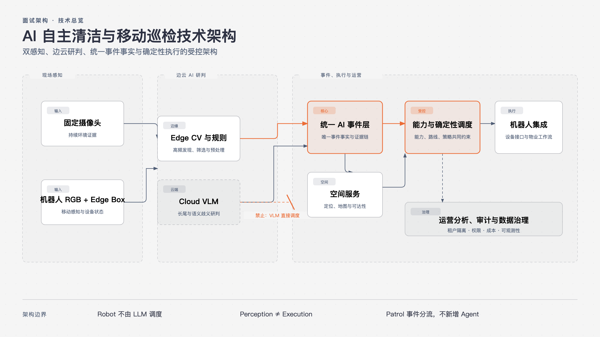
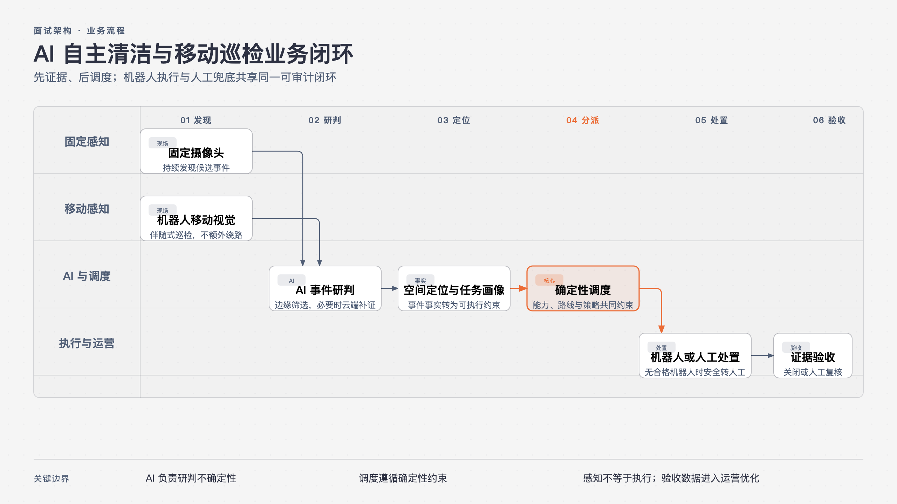

# AI 自主清洁与移动巡检一体化系统

> 面试架构设计唯一母文档（Markdown Source of Truth）

## 文档定位

[CONFIRMED] 本文档维护《AI 自主清洁与移动巡检一体化系统》在面试架构设计中的最新有效结论，面向 AI 解决方案工程师 / 专家类面试。它用于说明业务理解、AI 架构、机器人整合、产品设计、成本意识和规模化路径。

本文档只管理面试架构设计，不替代 Demo 的实现、验收或运行文档。后续更新必须先完整阅读本文档，将新结论合入对应章节，删除失效内容并合并重复描述。若新结论与本文档的 [LOCKED] 决策冲突，必须先提示并等待确认，不得自行覆盖。

## 1. 行业背景、客户需求与解决方案目标 [LOCKED]

本章回答项目为何产生、客户真正缺少什么、传统机器人的能力边界，以及系统为何升级为“自主清洁与移动巡检一体化系统”。YOLO、VLM、SLAM 等技术细节不作为本章重点。

### 1.1 行业与资源基础

项目不是为面试凭空设计的 Demo，而是源自大型物业客户在实际沟通中提出的业务需求。万物云长期服务大型物业，通过科技能力增强物业服务、项目签约与项目竞争力，场景覆盖产业园区、企业园区、商业空间和办公楼宇等。

万物云的优势不在于制造清洁机器人，而在于长期位于物业运营一线，能够同时接触客户、物业流程、保洁与安保团队、固定摄像头、园区基础设施、机器人厂商和不同机器人的现场使用情况。因此，更容易发现机器人本体能力与物业真实运营需求之间的断层。

万物云与多个机器人厂商存在合作关系。若形成一套可跨品牌复用的 AI 自主清洁与移动巡检系统，就具备把客户场景、AI 能力、物业流程与机器人生态整合为行业方案的条件。

> [PUBLIC FACT CHECK REQUIRED] “行业第一”、具体客户案例或排名等对外宣传式表述，必须经万物云官网、公开新闻稿或其他公开资料验证后，才能写成正式事实；本母文档不将未经核验的说法作为绝对事实。

### 1.2 客户需求与传统清洁机器人的能力断层

现有清洁机器人通常已具备同步定位与建图（SLAM）、导航、避障、自动清洁和路线执行能力，但主要仍按照固定时间、固定区域、固定路线和预设规则工作，即“计划驱动清洁（Schedule-driven Cleaning）”。

例如，机器人每天上午 10 点清扫大厅；若 10:15 有人洒落饮料，传统规则式机器人不会因刚出现的清洁需求而自动调整任务优先级。问题不是机器人不会清洁，而是它不知道现在什么地方最需要清洁。

传统机器人主要解决“怎么清洁（How to clean）”；本系统进一步解决“何时、何地需要清洁（When and where should cleaning happen）”：何时需要清洁、哪里需要清洁、应派哪种机器人，以及清洁是否真正完成。客户真正需要的是“事件驱动清洁（Event-driven Cleaning）”。

### 1.3 产品创新一：从规则式清洁升级为事件驱动自主清洁

项目第一层创新是利用园区既有固定摄像头（Fixed Camera）形成环境感知网络，建立以下闭环：

固定摄像头发现候选事件 → AI 识别垃圾、污渍或清洁需求 → 必要时补充语义研判 → 视觉坐标转换为机器人空间坐标 → 生成结构化清洁任务画像 → 匹配机器人能力 → 确定性调度 → 机器人执行 → 获取清洁后证据 → AI 验收 → 闭环。

机器人不再只是按照计划执行的独立设备，而是由环境事件动态驱动的执行终端。面试核心表达为：**传统机器人重点解决“怎么扫”，本系统进一步解决“什么时候、去哪里扫”。**

### 1.4 产品创新二：机器人升级为移动视觉感知节点

在与客户及机器人厂商的进一步沟通中，机器人不再只被视为清洁机器人（Cleaning Robot）。机器人已有 RGB 摄像头，且每天都会沿厂商原生清洁路线、AI 动态清洁路线、正常导航路径和跨区域任务路径真实移动。

系统复用这些既有移动行为与 RGB 摄像头，使机器人在完成原本任务时进行“伴随式移动视觉巡检（Opportunistic Mobile Inspection）”。这不是为了巡检额外跑一遍路线，而是在本来就会发生的移动过程中顺路完成视觉巡检，提高机器人资产利用率。

机器人因此具有双重身份：

- 清洁执行终端（Cleaning Actuator）。
- 移动视觉感知节点（Mobile Perception Node）。

### 1.5 机器人边缘 AI 终端（Robot Edge AI Box）

为实现统一接入与移动 AI 感知，机器人侧增加机器人边缘 AI 终端（Robot Edge AI Box）。它不是机器人导航主控，不替代厂商既有的 SLAM、底盘控制、避障、运动控制或清洁控制。

其职责分为两部分：

1. **机器人接口整合（Robot Interface Integration）**：通过厂商开放接口接入机器人状态、位置、电量、当前任务、任务下发、执行状态、执行结果和必要设备能力，形成跨品牌机器人的统一上层接入。
2. **移动视觉 AI（Mobile Vision AI）**：接入机器人自身 RGB 摄像头，在边缘侧部署 YOLO、专项 CV 模型与规则逻辑等适合本地运行的视觉能力，使机器人在移动途中识别物业巡检事件。

第一阶段典型场景为非机动车违停、垃圾桶周边散落垃圾、公共区域散落垃圾，以及其他适合用专项 CV 稳定识别的物业巡检事件。Robot Edge AI Box 因而同时连接机器人动作 / 状态接口与 RGB 感知，是“机器人集成网关 + 移动边缘 AI 节点（Robot Integration Gateway + Mobile Edge AI Node）”。

### 1.6 固定与移动双感知（Fixed + Mobile Dual Perception）

系统不是单一固定摄像头架构，而是由固定摄像头感知（Fixed Camera Perception）与机器人移动感知（Robot Mobile Perception）组成互补的双感知能力。

固定摄像头提供 7×24 持续覆盖、稳定视角、事件发现、清洁前后对比和 AI 验收；其边界是摄像头盲区、支路或转角等区域覆盖不足，扩大覆盖通常需要新增摄像头与施工成本。

机器人 RGB 摄像头随机器人持续移动，可覆盖固定摄像头无法持续观察的区域，复用既有路线顺路巡检，无需为简单巡检另增一套移动设备，并提升既有机器人资产的感知价值。

两者汇入统一 AI 事件层（Unified AI Event Layer）：固定摄像头感知 → 统一事件层 ← 机器人移动感知。

### 1.7 清洁事件与巡检事件必须分流

移动机器人发现事件，不等于机器人必须自己处理该事件；机器人既可以是执行器，也可以只是感知节点。**感知不等于执行（Perception ≠ Execution）** 是本项目的重要产品与技术边界。

例如，机器人 RGB 通过边缘 CV（Edge CV）发现垃圾桶周边散落垃圾后，事件作为清洁事件（Cleaning Event）进入能力引擎（Capability Engine）：若当前机器人具备清洁能力则执行清洁；否则由其他机器人或人工工单（Human Work Order）处理。

若发现非机动车违停，则作为巡检事件（Patrol Event）进入物业 / 安保工作流，由安保或物业人员处置；机器人不负责移动非机动车。Patrol Event 是业务事件分流，不表示新增 Patrol Agent。

### 1.8 正式产品定位

原项目为“AI 自主清洁闭环系统”，现正式升级为：**AI 自主清洁与移动巡检一体化系统**。

推荐完整定位：面向大型园区物业场景，通过固定摄像头与机器人移动 RGB 视觉组成双感知网络，利用边云协同 AI 完成现场事件发现与研判，通过空间定位、机器人能力模型和确定性调度完成自主处置，并利用机器人既有移动路径进行伴随式巡检，最终形成“发现 → 研判 → 定位 → 调度 → 执行 → 验收 → 运营”的一体化物业 AI 闭环。

机器人正式定义保持为：**Cleaning Actuator + Mobile Perception Node**。

### 1.9 三方价值模型

本方案形成甲方客户、机器人厂商与万物云的三方价值闭环。

**甲方客户**从清洁自动化（Cleaning Automation）升级为“清洁自动化 + 巡检自动化（Patrol Automation）”。价值机制包括减少重复人工保洁巡查、降低部分安保人工巡检工作量、提升异常事件发现速度、提高机器人利用率，以及从固定计划运营转向事件驱动运营。未经真实项目数据验证，不直接宣称减少具体人数或伪造百分比 ROI。

**机器人厂商**继续提供机器人硬件（Robot Hardware）、SLAM、导航、避障、清洁能力与设备控制；本系统提供物业业务场景、AI 事件智能、多机器人接入与上层编排。双方是“Robot OEM Capability + Property AI Orchestration”的协作关系，而非替代关系。

**万物云**不需要成为机器人制造商，其核心价值来自客户场景、物业运营能力、AI 视觉能力、现场数据与多机器人生态整合。最终销售的不是单一机器人硬件，而是 AI 自主清洁与移动巡检行业解决方案。

### 1.10 六项总体架构目标

1. **事件驱动（Event-driven）**：从计划驱动清洁升级为事件驱动的清洁 / 巡检。
2. **固定与移动双感知（Fixed + Mobile）**：形成固定摄像头与机器人 RGB 摄像头的双感知网络。
3. **跨品牌接入（Robot Agnostic）**：通过 Robot Adapter 与能力画像降低对单一厂商的绑定。
4. **AI 与确定性分工（AI + Deterministic）**：AI 解决感知不确定性；空间、能力、调度、路线与执行由确定性算法负责，避免 LLM 控制所有环节。
5. **成本意识（Cost-aware）**：将已验证的高频稳定问题从 Cloud 迁移至 Edge，提高边缘覆盖率，降低云端升级率与长期 AI 总拥有成本（TCO）。
6. **可规模化（Scalable）**：通过租户数据隔离（Tenant Data Isolation）与授权能力复用（Authorized Capability Reuse），形成基础能力与项目适配能力，缩短新项目冷启动周期。

### 1.11 第一章最终因果链

大型物业真实场景 → 客户提出创新机器人需求 → 传统机器人仅能计划驱动清洁 → 缺乏环境事件主动发现能力 → 固定摄像头促成事件驱动清洁 → 机器人从规则设备升级为动态执行终端 → 进一步利用机器人 RGB → Robot Edge AI Box → 机器人升级为移动感知节点 → 固定与移动双感知 → 清洁与巡检分流 → 甲方 / Robot OEM / 万物云三方价值 → 兼顾成本与规模化的 AI 架构。

## 2. 系统整体架构总览 [CONFIRMED]

系统以“环境事件驱动、确定性处置、边云协同感知”为核心。面向客户的不是机器人控制台，而是统一的物业事件运营平台：固定摄像头与机器人移动视觉发现事件，AI 负责研判不确定性，确定性系统负责定位、能力匹配、调度、执行与验收。

目标架构包含六层：

1. **感知层**：固定摄像头、机器人 RGB 与 Robot Edge AI Box 产生可追溯的现场证据。
2. **AI 研判层**：Edge CV、规则与 Cloud VLM 识别事件、补充语义并判断证据是否充分。
3. **事件与空间层**：统一 AI 事件层管理事件事实；空间服务把合法视觉定位转换为可执行空间目标。
4. **编排与执行层**：能力引擎、确定性调度、路线规划与机器人集成网关负责受限的确定性处置。
5. **运营层**：事件中心、运营分析与 Robot Operations Agent 只消费同一业务事实，不维护第二份状态。
6. **治理层**：租户隔离、数据授权、模型评估、审计、回滚和成本治理贯穿全流程。

边界明确：机器人厂商仍负责底盘、SLAM、导航、避障与设备控制；本系统负责跨设备的上层事件智能、业务编排和物业运营闭环。

## 3. 自主清洁与移动巡检业务闭环 [CONFIRMED]

### 3.1 自主清洁闭环

清洁闭环从可验证的环境事件开始：发现垃圾、污渍或清洁需求后，系统先判断证据是否足以进入处置；必要时补充合法视角，再完成位置转换、任务画像生成、能力匹配和确定性调度。机器人执行后，固定摄像头或合法现场证据进入验收，最终关闭事件或转入安全的人工路径。

核心原则是“先证据，后调度”：没有充分证据、合法位置或合格机器人时，系统不伪造自动处置。

### 3.2 伴随式移动巡检闭环

机器人在原生清洁、动态清洁或正常导航中持续产生移动视觉输入。Robot Edge AI Box 在边缘侧筛选适合 CV 稳定识别的场景，并将候选事件送入统一 AI 事件层。事件按类型分流：清洁事件进入清洁工作流；违停等 Patrol Event 进入物业或安保工作流。

伴随式巡检不应为简单巡检额外规划路线。它复用既有移动行为，补足固定摄像头盲区，并在不替代人或机器人既有职责的前提下提高资产利用率。

### 3.3 异常与人工闭环

当证据不足、空间定位失败、无合格机器人、路线不可达或验收无法确认时，系统进入可解释的人工复核（Human Review）或人工兜底（Human Fallback）。人工处置完成后，事件回到验证环节；人工不是被静默忽略的异常出口，而是闭环中可审计、可复核的正式参与者。

## 4. 事件数据流与时序 [CONFIRMED]

统一 AI 事件层是所有业务投影的唯一事件事实源。它记录事件来源、证据、语义判断、位置、处置建议、执行轨迹与最终结果；页面、分析和 Agent 只能读取或在受控权限下委托这条事实链。

事件数据流为：现场感知产生候选证据 → 边缘侧创建候选事件与证据记录 → 仅在低置信度、长尾或语义歧义时升级到 Cloud VLM → 事件层校验阶段、位置和策略 → 提交结构化任务画像 → 能力引擎与调度系统下发合法执行计划 → 机器人或物业工作流回传结果 → 获取清洁后证据 → 验收并发布最终业务状态。

事件至少遵守以下数据原则：

- **证据先于结论**：未来阶段的清洁后证据、未取得的补充视角和未授权数据，不得被当前业务消费者读取。
- **模型判断与系统决策分离**：模型输出语义、置信度和证据充分性；业务规则决定是否定位、派单、转人工或关闭。
- **阶段不可倒退**：状态迁移必须合法、可审计，并在失败后留下可解释终态。
- **同一事实多处投影**：运营页面、事件详情、Agent、分析和高级审计读取同一事件链，而不是复制业务状态。

Patrol Event 与 Cleaning Event 是否采用统一事件结构（Event Schema）仍是开放决策；无论最终模型如何，事件层都必须支持按事件类型分流，并保留统一的审计与证据原则。

## 5. 边缘与云端 AI 感知架构 [CONFIRMED]

边云协同的目的不是把所有视觉任务交给云端，也不是让边缘端承担长尾语义。系统根据任务频率、稳定性、时效性和不确定性在 Edge 与 Cloud 之间分工。

| 层级 | 主要职责 | 典型输入 | 输出边界 |
| --- | --- | --- | --- |
| Edge | 高频候选发现、专项 CV、规则过滤、设备侧事件预处理 | 固定摄像头 / 机器人 RGB | 候选、结构化视觉事实、质量信号 |
| Cloud | 冷启动、长尾问题、低置信度、分布外场景（OOD）、语义歧义与复杂上下文研判 | 合法且当前可用的证据集 | 语义判断、证据充分性、风险提示 |
| 确定性系统 | 空间、能力、调度、路线、状态机与权限约束 | 已验证业务事实 | 可执行或安全终止的系统决策 |

Cloud VLM 是受限的智能研判层，不是机器人调度器。它不能直接选择机器人、修改地图、调整阈值、绕过能力约束或替代流程状态机。默认架构不引入本地小型 VLM；只有在业务、硬件、离线评估和运维边界明确后，才可另行评估。

Cloud VLM 的输出可作为教师信号（Teacher Signal）、人工复核线索或迁移候选依据，但不等于真实标准答案（Ground Truth）。训练、标注与生产处置必须经过独立验证和治理，禁止“自动无监督在线自学习”的叙事。

## 6. 云到边缘的能力飞轮 [CONFIRMED]

能力飞轮的目标是把已经验证清楚的高频问题，从昂贵、通用的 Cloud Intelligence 迁移为便宜、稳定、确定性的 Edge Intelligence；它不是让 YOLO 变成大模型，也不是把所有问题都迁移到边缘。

路径为：云端长尾案例 → 经验证并治理的数据 → 边缘迁移评分 → 专项 CV 或 CV 加规则 → 离线与困难样本评估 → 影子模式（Shadow Mode）→ 灰度发布（Canary）→ 边缘正式运行 → 监控与回滚 → 提高边缘覆盖率、降低云端升级率。

每个候选能力使用五项边缘迁移评分（Edge Migration Score）评估：事件频率、视觉稳定性、任务可定义性、数据成熟度和经济收益，每项 0–5 分。

- 20–25 分：优先迁移。
- 15–19 分：进入候选池，继续积累数据和验证。
- 低于 15 分：保留 Cloud 路径。

模型推广必须经过训练、离线评估、困难样本回归、影子模式、灰度发布、正式运行、监控与回滚。任何阶段不通过，都回到数据、规则或 Cloud 路径，而不是自动扩大上线范围。

## 7. 组合能力飞轮 [CONFIRMED]

组合能力飞轮在保证客户数据主权的前提下，缩短新项目的冷启动和适配周期。原则是“租户数据隔离（Tenant Data Isolation）+ 授权能力复用（Authorized Capability Reuse）”。

每个客户的原始数据（Raw Data）、事件、图像、任务和运营数据默认隔离，不能因同属一个物业科技平台而直接互通。只有经过客户授权、脱敏、治理审查和标签统一的数据，才可进入授权公共数据集（Authorized Common Dataset）。

在授权边界内，平台可沉淀可复用的基础能力：

1. 从多项目的授权样本中形成基础通用能力（Global Base Capability）。
2. 结合园区地图、机器人能力、业务规则和现场视觉差异完成项目适配（Site-specific Adaptation）。
3. 将成熟行业能力以受控方式带入新项目，减少冷启动与交付适配成本。

可复用的是经过治理的能力、方法和模型资产，不是客户原始数据或未经授权的业务事实。

## 8. 机器人确定性调度架构 [CONFIRMED]

机器人调度必须是确定性系统。AI 可以识别“发生了什么”，但不负责决定“哪台机器人执行”；机器人选择由可审计的业务约束和算法完成。

调度路径为：任务画像（Task Profile）→ 能力引擎（Capability Engine）→ 硬约束过滤（Hard Constraint Filter）→ 合格机器人列表（Eligible Robots）→ 确定性评分 → 路线规划 → 机器人分派 → 执行或安全兜底。

### 8.1 任务画像

任务画像由事件事实生成，描述任务类别、位置、所需能力、紧急程度、时间要求、证据与处理约束。它是感知层到调度层的契约，不携带模型的自由文本推理作为执行指令。

### 8.2 能力与约束

能力引擎根据机器人能力画像判断任务适配性；硬约束过滤排除不具备任务能力、位置或部署权限不符、正在执行冲突任务、电量或安全条件不满足、路线不可达的机器人。没有合格机器人时，系统转入人工兜底或等待人工编排，而非让模型猜测替代方案。

### 8.3 评分、路线与执行

合格机器人按明确的确定性评分规则排序，例如任务适配度、可达性、状态、电量、距离与业务优先级；路线规划在统一空间图中验证可行路径后，才生成分派。评分权重和业务规则可配置、可版本化、可审计，但不能由 LLM 在运行时自行改写。

## 9. Agent 设计与边界 [CONFIRMED]

系统只保留两个 Agent，二者的自主性均限定在明确的工具与业务边界内。

| Agent | 解决的问题 | 允许的自主性 | 明确禁止 |
| --- | --- | --- | --- |
| 多视角感知 Agent（Multi-view Perception Agent） | 单一视角证据不足时，如何取得合法补充证据 | 在覆盖范围与证据白名单内发现、获取并判断补充视角 | 修改地图、标定、阈值、机器人能力、调度或路线 |
| 机器人运营 Agent（Robot Operations Agent） | 如何理解自然语言运营查询、任务意图和受限低风险操作 | 调用白名单读工具、生成分析、编排合法低风险工具动作 | 选择清洁机器人、直接控制底盘、绕过 Policy Guard、修改基础设施 |

多视角感知 Agent 只在可恢复的证据不足场景工作，补证数量、轮次和证据范围受预算限制；证据充分后由系统进入统一业务流程。

机器人运营 Agent 面向运营人员，是自然语言入口而非独立控制平面。它读取同一事件、任务、机器人和分析事实；如需执行动作，必须经过工具参数校验、权限、部署策略和 Policy Guard。运营分析建议（Analytics Advice）是它的只读分析能力，不是第三个 Analytics Agent。系统不新增 Patrol Agent。

## 10. 事件状态生命周期 [CONFIRMED]

事件生命周期的目标是让每次业务处置都可解释、可追溯并安全终止。Cleaning Event 与 Patrol Event 可采用不同业务字段和处置分支，但应共享证据可用性、审计、权限和终态语义。

| 阶段 | 目标 | 进入条件 | 可能去向 |
| --- | --- | --- | --- |
| 已发现（Detected） | 记录候选事件 | 合法感知输入 | 研判中 / 已拒绝 |
| 研判中（Assessing） | 判断事件与证据充分性 | 当前清洁前证据可用 | 补充证据 / 已定位 / 人工复核 |
| 补充证据（Enriching） | 获取合法补充证据 | 可恢复的证据不足 | 研判中 / 人工复核 |
| 已定位（Located） | 生成可执行位置 | 合法空间映射成功 | 已规划 / 人工复核 |
| 已规划（Planned） | 生成任务画像与处置方案 | 业务规则与权限满足 | 已分派 / 人工兜底 |
| 已分派（Assigned） | 选择合格执行主体 | 能力、路线与策略通过 | 执行中 / 人工兜底 |
| 执行中（Executing） | 执行清洁或物业工作流 | 处置主体接受任务 | 验证中 / 人工复核 |
| 验证中（Verifying） | 使用实际发生的清洁后证据验收 | 清洁后证据当前可用 | 已关闭 / 人工复核 |
| 已关闭（Closed） | 形成可审计闭环 | 验收通过或业务确认完成 | 归档 / 分析 |

人工复核用于无法安全自动判断的事件；人工兜底用于系统确认需要人工完成的处置。两者都必须保留原因、责任边界和后续动作，不得成为静默丢弃事件的状态。人工完成后需重新进入验证中，避免“人工做过”被直接等同于“已验收”。

## 11. 目标模块架构与核心模块速审 [CONFIRMED]

本章描述面向面试的目标模块映射，用于说明系统如何分层，不对当前代码覆盖度作声明。

| 目标模块 | 核心职责 | 主要输入 | 主要输出 |
| --- | --- | --- | --- |
| 感知（Perception） | 接入固定摄像头与机器人 RGB，执行 Edge CV、规则和 Cloud VLM 升级 | 图像、视频帧、摄像头上下文 | 结构化候选事件与证据 |
| 事件与工作流（Event and Workflow） | 管理事件事实、状态机、证据可用性和业务分流 | 候选事件、模型判断、人工动作 | 标准事件、状态迁移、任务画像 |
| 空间（Spatial） | 维护摄像头到 SLAM 的映射、地图、拓扑与位置合法性 | 摄像头上下文、视觉目标、地图事实 | 可执行位置、路线请求 |
| 能力与调度（Capability and Scheduling） | 管理机器人能力、硬约束、评分和分派 | 任务画像、机器人集群状态、部署策略 | 合格机器人、分派结果 |
| 机器人集成（Robot Integration） | 对接跨品牌 Robot Adapter 与 Edge AI Box | 分派、任务命令、设备状态 | 标准化设备状态与执行结果 |
| Agent 与策略（Agent and Policy） | 提供多视角与运营的受限工具能力 | 证据不足、自然语言意图、权限上下文 | 合法工具调用、运营解释 |
| 分析（Analytics） | 聚合闭环事实，形成 KPI、热点、利用率和运营建议 | 标准事件、状态迁移、机器人事实 | 运营指标与只读洞察 |
| 可观测与治理（Observability and Governance） | 审计模型、工具、状态、数据授权和成本 | 事件链、调用记录、治理策略 | 追踪、审计、风险和成本信号 |

模块间只能通过明确事实或受控命令协作：Perception 不直接派单；Agent 不绕过 Policy；Analytics 不修改业务真相；Observability 不重跑模型或调度；Robot Integration 不替代厂商底层控制。

## 12. 成本、KPI、架构边界与面试总结 [CONFIRMED]

### 12.1 成本框架

成本讨论应聚焦驱动因素，而非未经验证的金额或 ROI。主要成本项包括摄像头与 Edge AI Box 部署、网络与存储、Cloud VLM 调用、专项 CV 训练与维护、机器人接入适配、现场交付与持续运营。系统通过事件筛选、提高 Edge Coverage、降低 Cloud Escalation Rate、复用能力和统一多机器人接入改善长期 TCO。

### 12.2 KPI 体系

KPI 用于衡量价值机制与治理效果，具体目标值必须由真实项目基线确定：

- **业务结果**：事件发现到闭环时长、人工介入率、按时完成率、异常发现覆盖率。
- **感知质量**：候选准确性、有效事件率、证据充分率、误报与漏报复核结果。
- **调度效率**：合格机器人覆盖率、派单成功率、路线可达率、设备利用率。
- **AI 与成本**：Cloud Escalation Rate、Edge Coverage、单位有效事件 AI 成本、迁移后成本变化。
- **安全与治理**：越权工具调用拦截率、证据阶段违规数、租户隔离与审计完整性。

### 12.3 架构边界

本方案不声称已经具备真实机器人遥测、生产级 RTSP / VMS、生产身份权限、外部平台授权、ROS / Nav2、分布式任务恢复或生产 SLA。它也不以模拟数据、受控证据或 Replay 代替真实生产事实。任何从 PoC 到生产的推进，都需要分别验证设备接入、数据授权、网络与可靠性、模型效果、现场流程和持续运维能力。

### 12.4 面试总结

面试表达应回到一条主线：物业客户不是缺少会清洁的机器人，而是缺少能够发现、判断并编排现场事件的运营系统。万物云基于物业场景与多机器人生态，把固定与移动双感知、边云 AI、确定性调度和可审计闭环整合为行业方案；AI 在不确定性处发挥作用，确定性系统在执行风险处承担责任，最终把单机自动化升级为可规模化的物业运营能力。

## 当前进度

- 第一章：[LOCKED] 已完成。
- 第二章至第十二章：[CONFIRMED] 已完成，构成完整的面试目标架构。
- 当前阶段：全篇面试审阅与开放问题确认；不进入代码实现。

## 已锁定决策

- [LOCKED] 项目正式升级为“AI 自主清洁与移动巡检一体化系统”。
- [LOCKED] Robot = Cleaning Actuator + Mobile Perception Node。
- [LOCKED] Robot Edge AI Box 是正式产品架构组成，不替代机器人厂商的导航与控制主系统。
- [LOCKED] Fixed + Mobile Dual Perception 是正式架构。
- [LOCKED] Cleaning Event 与 Patrol Event 按业务类型分流；Perception ≠ Execution。
- [LOCKED] 移动巡检不新增第三个 Agent；系统仅保留 Multi-view Perception Agent 与 Robot Operations Agent。
- [LOCKED] 六项总体架构目标已锁定。
- [LOCKED] 确定性问题使用工作流、规则或算法；仅在存在不确定性与自主工具选择时使用 Agent。
- [LOCKED] 机器人调度采用“任务画像 → 能力引擎 → 硬约束过滤 → 合格机器人 → 确定性评分 → 路线规划 → 机器人分派”；LLM / VLM 不选择机器人。
- [LOCKED] Cloud VLM 的 Teacher Signal 不等于 Ground Truth；不采用自动无监督在线自学习叙事。
- [LOCKED] 客户 Raw Data 默认隔离；只有经授权、脱敏、治理与标签统一后，才能进入 Authorized Common Dataset。

## 当前开放问题

- [OPEN] Patrol Event 与 Cleaning Event 最终是否采用统一事件结构（Event Schema）。
- [OPEN] Robot Edge AI Box 的详细软件 / 硬件分层。
- [OPEN] 移动巡检（Mobile Inspection）第一阶段算法范围最终清单。

## 下一步行动

围绕现有 [OPEN] 项进行面试审阅与结论确认；未经明确授权，不修改代码或现有 Demo 文档。

## 已删除方案

- [DROPPED] AI Task Queue
- [DROPPED] Priority AI Scheduler
- [DROPPED] Cloud Burst
- [DROPPED] Cost Agent
- [DROPPED] Token Agent
- [DROPPED] Budget Agent
- [DROPPED] 默认 Local VLM
- [DROPPED] Patrol Agent
- [DROPPED] LLM Robot Scheduler
- [DROPPED] 自动无监督在线自学习
- [DROPPED] 客户 Raw Data 直接互通

## 最近一次更新时间

2026-09-04 CST
